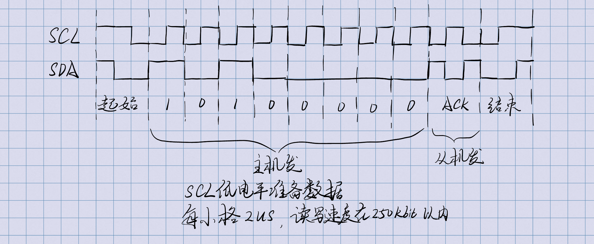
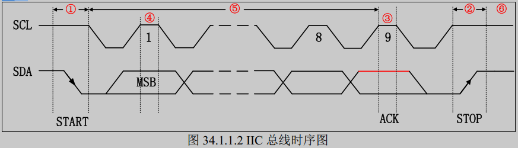

# 嵌入式基础知识

## IIC, UART, SPI 的异同？
IIC(Inter-Integrated Circuit(集成电路总线))
* 有几根线？
  * 两根：数据线和时钟线；
* 为什么不算地线？
  * 默认通讯双方是共地的；
* 软IIC的通讯过程
  * 
* 更新下一位数据的时机是时钟下降沿？
* 时序图
  * 
* 为什么没有地址线？
  * 地址是总线上前若干个字节的数据
  * 如果是数据的接收方，那就回复ACK，否则就装死
* 如何区分读写？
  * 同样也是靠总线上前若干个字节的数据来判断读写
  * 具体的IIC协议，需要看通讯的设备协议
* 怎么实现多主的？
  * 总线仲裁
* AT24C02通讯协议？
  * 写一个字节的过程
    * 主机发送IIC起始信号
    * 主机发送第一个字节: 10100000，进入写状态(高四位1010为固定起始，低四位0000的前三位为硬件地址，对应AT24C02的A0,A1,A2三根引脚的电平，最后一位表示进入读/写状态，0为写，1为读)
    * 从机ACK
    * 主机发送第二个字节: 要写的地址
    * 从机ACK
    * 主机发送第三个字节: 要写入的数据
    * 从机ACK
    * 主机发送IIC结束信号
  * 读一个字节的过程
    * 主机发送IIC起始信号
    * 主机发送第一个字节: 10100000，进入主机发送状态
    * 从机ACK
    * 主机发送第二个字节: 要读取的地址
    * 从机ACK
    * 主机发送IIC起始信号
    * 主机发送第三个字节: 10100001，进入主机接受状态
    * 从机发送第四个字节: 主机要读取地址的数据
    * 主机ACK
    * 主机IIC结束信号
* 怎么两次起始信号间可以没有结束信号？
  * 每次数据传送总是由主机产生的终止信号来结束。但是，若主机希望继续占用总线进行新的数据传送，则可以不产生终止信号，马上再次发出起始信号对另一从机进行寻址。
* 为什么说STM32的硬件IIC是鸡肋？
  * 硬件IIC仅适用于总线结构简单、器件标准、稳定的情况下，不然及其容易卡死
  * 软件IIC由于是人写的，更容易调试，ACK慢的话，多等一会就行
* IIC的帖子
  * [I2C的七宗罪](https://www.eet-china.com/mp/a371616.html)
  * 一宗罪：复位
    * 主要讲解了CPU复位，但EEPROM不复位情况下，可能会发生的问题
    * 首先了解到，SDA和SCL有上拉电阻，而各设备的引脚是开漏的（只能下拉，无法上拉）
    * 如果CPU要读EEPROM数据，EEPROM正在发数据的时候，CPU被复位了，由于时钟是CPU控制的，那就存在EEPROM一直将SDA拉低，等待SCL上的时钟信号。
    * 要解决这种问题，那就是CPU上电后，如果发现SDA引脚被拉低了，那么连续发送9个时钟信号，即可让EEPROM释放掉SDA；

## 开漏、上拉电阻、下拉电阻
* 为什么设计成开漏，有没有反过来的情况
## 量化比较串行总线和并行总线

## RS232，RS485，CAN，USB的异同？

## 大端、小端、字节序、MSB、LSB、MSBs、LSBs

## EEPROM，Flash的区别？

## J-Link，JTAG等是什么

* 一分钟的爱情故事
* 抽奖

