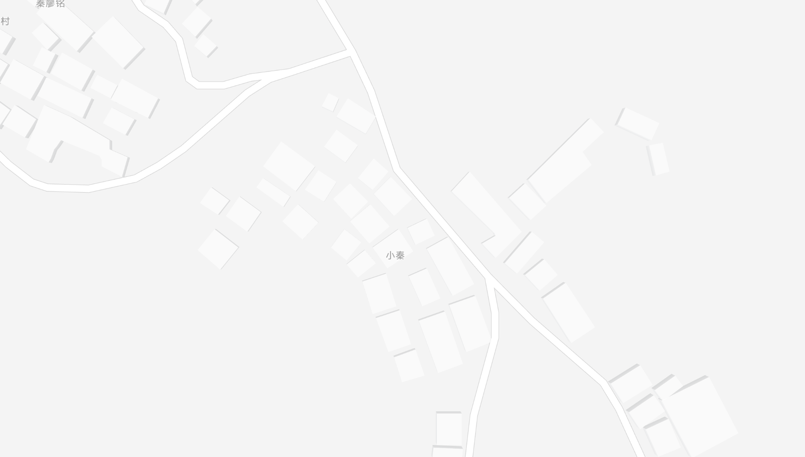

# 2025年1月
|  Day | date | End of work | study | exercise |
| ---: | ---: | ----------: | ----: | -------: |
|  Wed |    1 |             |       |          |
|  Thu |    2 |       20:30 |       |          |
|  Fri |    3 |       18:00 |       |          |
|  Sat |    4 |             |       |          |
|  Sun |    5 |             |       |          |
|  Mon |    6 |       21:00 |       |          |
|  Tue |    7 |       20:00 |       |          |
|  Wed |    8 |       21:00 |       |          |
|  Thu |    9 |       22:00 |       |          |
|  Fri |   10 |       18:00 |       |          |
|  Sat |   11 | extra  5:00 |       |          |
|  Sun |   12 |        年会 |       |          |
|  Mon |   13 |        年会 |       |          |
|  Tue |   14 |       21:00 |       |          |
|  Wed |   15 |       21:00 |       |          |
|  Thu |   16 |       21:00 |       |          |
|  Fri |   17 |       18:00 |       |          |
|  Sat |   18 | extra  6:00 |       |          |
|  Sun |   19 |             |       |          |
|  Mon |   20 |       18:00 |       |          |
|  Tue |   21 |       18:00 |       |          |
|  Wed |   22 |       18:00 |       |          |
|  Thu |   23 |        过年 |       |          |
|  Fri |   24 |        过年 |       |          |
|  Sat |   25 |        过年 |       |          |
|  Sun |   26 |        过年 |       |          |
|  Mon |   27 |        过年 |       |          |
|  Tue |   28 |        过年 |       |          |
|  Wed |   29 |        过年 |       |          |
|  Thu |   30 |        过年 |       |          |
|  Fri |   31 |        过年 |       |          |

## 第一周
### 1 周三
* 去静安寺跨年
### 2 周四
* 加到八点半
### 3 周五
* 周五晚到周天玩了一个周末
## 第二周
### 7 周二
* 新建了一个表格，用于记录一些时间相关的参数
* 把[money.md](../money.md)更新了一下
* 顺便新建了一个CSV文件: [money.csv](../money.csv)，方便计算差值、结余什么的
* 再看了看之前的记录，看到写论文那会真是感叹
### 8 周三
* 今天有个事还是挺值得记录的
  * 邱工测出来结果，我只一味的去看代码，没去研究问题可能出在哪
  * AB是互传数据的，A不能传到B，我都没想到去验证B的数据能不能传到A
  * 就是一股脑看代码，分析代码，然后程序流程图，完全就没有一点自己的想法
  * 叫啥做啥，这真的很不好

### 13 周一
* 昨天的年会，一个团队奖都没有，晚宴不好吃，抽奖也没抽到
* 今天的运动会篮球赛，没看完就走了，但结局应该是没赢
* 下午打了会帝国，睡了一觉

### 24 周五
* 已经放假到家，然后发现并没有什么人能约出来玩
* 那就做自己的事：
  * [x] 买袄子
  * [ ] 买年货
  * [ ] 准备回忆录问题话题
* 回忆录
  * 童年：上学及上学前的时期 
    * 在哪出生：
    * 家庭情况：常年在家的家人，有哪些亲戚
    * 邻居：
  * 成年
    * 哪些行业、项目
    * 包产到户，改革开放
    * 社会风气的变化
* 小时候
  * 家是怎么样的（房间、庭院布局）
  * 队里面怎么上工
  * 经常去谁家玩
  * 天天干啥，未来想干什么