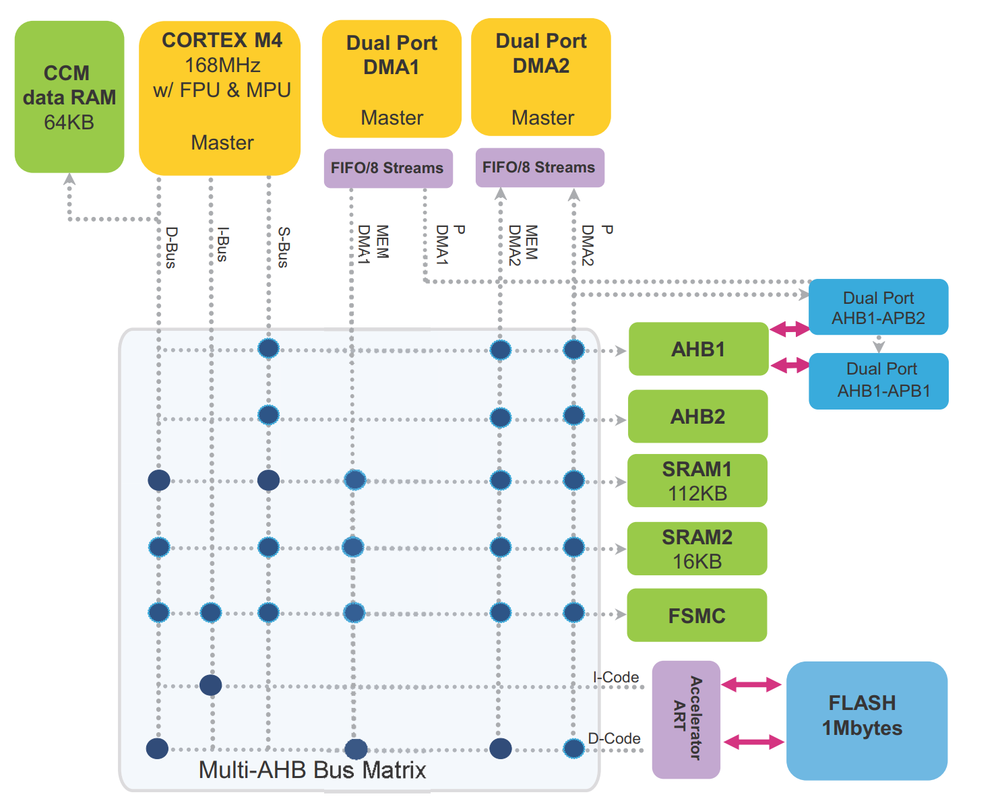

# 2025/6

## 3
* 今天周会上讨论寄存器
  * 主要是疑惑：CPU内部的存储单元叫寄存器，为什么用于记录外设配置的存储器用的也叫寄存器
  * 随后查阅 STM32F103 的芯片手册，发现与 Cortex-M3 CPU 直接连接的有三种总线：Instruction bus, data bus, system bus。https://zhuanlan.zhihu.com/p/96126833
  * 前两者的说法是统一的，但S-bus各有各的说法
  * 好，回来，首先，从计组的角度出发，Cortex-M3 CPU 的寄存器有16组，每组32位，其中13组为通用寄存器（r0~r12），pc，lr，psr，这些寄存器是由 D 触发器（D Flip-Flop） 构成的高速逻辑电路阵列
  * STM32采用了统一编址的方式，将存储器和外设都映射到一个4GB的逻辑地址空间中，即内存映射IO，与之对应的是x86架构对应的PortIO
    * 
    * https://2048.csdn.net/68269604606a8318e8568cc3.html
  * 所以配置外设寄存器、内核系统外设寄存器，实际上是 memory-mapped 地址对应的一段特殊 RAM 电路（寄存器单元）
  * 总结：“CPU 直接操作的寄存器是真正的‘处理器内部硬寄存器’，是由高速逻辑触发器阵列组成；而我们常说配置外设的‘寄存器’，只是存储器地址空间中映射的‘特殊内存单元’，虽然也叫寄存器，但本质和访问方式完全不同。”
* 发现正点原子对寄存器有自己的解释：
  * 5.3.4 寄存器映射
    * 给存储器分配地址的过程叫存储器映射，寄存器是一类特殊的存储器，它的每个位都有特定的功能，可以实现对外设/功能的控制，给寄存器的地址命名的过程就叫寄存器映射。
    * 举个简单的例子，大家家里面的纸张就好比通用存储器，用来记录数据是没问题的，但是不会有具体的动作，只能做记录，而你家里面的电灯开关，就好比寄存器了，假设你家有8个灯，就有8个开关（相当于一个8位寄存器），这些开关也可以记录状态，同时还能让电灯点亮/关闭，是会产生具体动作的。为了方便区分和使用，我们会给每个开关命名，比如厨房开关、大厅开关、卧室开关等，给开关命名的过程，就是寄存器映射。
* 作为对比，我想了解 IMXRT1176 和 Intel i7-12700H 芯片
* Cortex-M3内核中，4G编码空间的最后0.5G，用来配置内部外设，被称为内核系统外设，通过S-Bus访问
  * 主要包括：SysTick，NVIC，SCB (System Control Block)，MPU (Memory Protection Unit)等

## 11
* 还是上周关于寄存器的进一步探究
* 首先，CPU访问的外设寄存器，硬件上是D触发器，与CPU内部的寄存器从硬件类型是一样的；
* D 触发器在时钟上升沿到来的瞬间，把输入的数据锁存进内部，之后无论 D 怎么变，Q 保持原值，直到下一个时钟沿；
* 每一种外设都有其控制器，比如串口控制器，定时器控制器，IO控制器等；
* 每一种外设控制器内部都有寄存器，有些有RAM，它们都与CPU的RAM、FLASH一样，统一编址；

## 25 周三
* 21号（周六）在steam上买了大侠立志传，每晚玩，玩到今天，算是通关；
* 14（周五）玩钢4直接通宵
* 所以我又打了两个星期的游戏，就感觉持续循环；
* 很难自制自己去学习，很难

上周六买了大侠立志传，周末两天加这三天晚上，算是玩通关了
通关后当然是很空虚，感觉又浪费时间了
然后发现又是很久很久没写日志
像失了魂一样的过了一天又一天
所以试着问了问deepseek，怎么能坚持写日志
说要跟习惯进行绑定
那我首先想到的就是晚上打电话的时候写日志，或者是等待打电话时候
打游戏确实是耗费时间，但我没有别的兴趣爱好去中和游戏，出门久了就会觉得很累，只想回去打游戏
打的时候很沉迷，打完了之后索然无味
疯狂花时间过剧情，随后再也不复习
可能游戏给人目的性强一点吧
生活里还有没有什么目的性强点的活动？

## 26 周四
加班后，沿着住的园区逛了一圈，发现我住了一年仍然不认路
准备八点前不要回住的地方，不管是加班，遛弯，吃饭啥的，反正别回去
运动量真的非常不够，身体感觉都给警告了
然后写了点东西
下午开了个分享会，发现有很多东西都不清洗，很多东西需要学习，嗯，需要学习

## 27 周五
今天源和她的好姐妹聚首了
骞哥分手，晚上打了个电话聊了聊
今天把脉冲参数重构了一下，然后试着用clangd来进行代码提示，挺好用的

## 28 周六
手机笔记
我找到了最牛逼的记笔记方式，那就是手机笔记！
小米云服务可以访问手机笔记，这样可以同步电脑和手机！
woc完美
满足了电脑打字的舒适性，和手机笔记的便捷性，真正实现每日写笔记！
就是发现手机端和电脑端有点不同步
然后又发现思维笔记模式做的还不是很健全，图片都不能贴，整体复制粘贴也有点问题，把写的几天内容转到文本笔记这边来了，现在小米自带的笔记只支持这两种类型的文档
可以，我很满意，可以把之前写的markdowm文档全部贴过来
重启STM32项目
刚好今天有空闲，完全不想打游戏，那就把现有项目的驱动调一下吧
检查了一下LCD的数据传输，CPU本身只需要往FSMC映射的地址写就行，相应引脚会自动转换为对应电平
而触摸屏选的引脚，就不能使用硬件SPI进行传输，所以只能用源驱动的软件SPI，困惑SPI的主从收发使用不同的沿是否是通用的做法，这样能实现全双工，离谱，上班一年了这还是混淆的；
SPI
时钟极性：空闲高电平或低电平
时钟相位：
CPHA=0，在时钟的第一个跳变沿（上升沿或下降沿）进行数据采样，在第2个边沿发送数据
CPHA=1，在时钟的第二个跳变沿（上升沿或下降沿）进行数据采样，在第1个边沿发送数据
LCD重要参数
2.8寸，分辨率320*240，16位色彩，驱动ICILI9341，显示区域57.6mmX47.2mm
数据线16根
FSMC在内存空间分了四块（FSMC1~FSMC4）：0x6000 0000~0x9FFF FFFF，每一块是256M字节
LCD_CS与FSMC_NE4相连：
每块FSMC里面又分了4个NE（NE1~NE4），FSMC_NEx映射的引脚可选，实现对通讯设备进行选择，例程用PG12复用为FSMC_NE4，与LCD_CS相连，实现对LCD的片选
某个FSMC用了NEx，其他FMSC就用不了该Nx，也就是最多用4个NEx（对于STM32F103）
LCD_RS与FSMC_RS相连：
命令/数据标志（0，读写命令； 1，读写数据）
首先FSMC1的NE4的基地址为0x6C00 0000，其次FSMC_RS的引脚选择影响了偏移量
从硬件看，将PG0重映射为FSMC_A10
从代码看，将FSMC_A10映射到FSMC_RS，FSMC_Ay（y = 0 ~ 25）偏移量的计算公式： 2^y * 2，所以偏移量就是0x800；
然后它说，0x6C00 07FE对应LCD_REG（寄存器编号/地址），0x6C00 0800对应LCD_RAM（数据）
我们写0x6C00 07FE，A10为0的同时，16跟数据线会将0x6C00 07FE开始的两字节发送出去，即将寄存器编号/地址发送
我们写0x6C00 0800，A10为1的同时，16跟数据线会将0x6C00 0800开始的两字节发送出去，即将数据发送
这其实就是用地址线控制 RS 信号，FSMC 自动帮你把地址线电平送到 RS 引脚。
LVGL
有例程可以直接参考

## 29 周天
看了一会LVGL，跑了个demo，
然后玩了一下午《大侠立志传》，通了西南剧情，然后走了皇帝结局
七点多，也不想出去骑车，点了个外卖，最后休息一会吧，今天算是休息了一天

## 30 周一
今天工作正事上没做啥，主要就是让别人改，反馈问题，倒是写了一点深度学习简析的内容，可能后面要汇报
晚上出去骑车，调了下前变速器，让它不刮链条，骑得时候发现膝盖还在疼，后面没法太使劲，然后后变速器也有问题
晚上看了会arm汇编的内容，感觉挺难看进去的