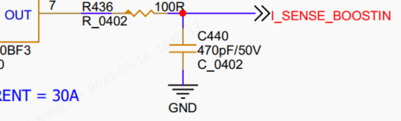
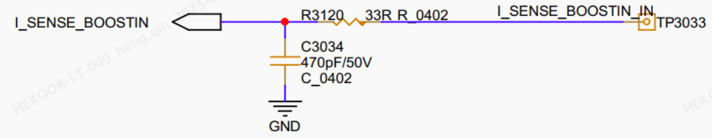

# 第一周
## 1.2 周四
### 贴片厂
* 去了趟贴片厂，看能不能发现是为什么1176有时候起不来
* 目前发现的现象是上电正常的话，后续都能正常，而上电后不正常，下一次掉电前，总是掉的问题会时常出现
### 去工厂更新西门子PLC
* 首先是同一网段，PLC是192.168.0.1，机箱是192.168.0.2，同一网段
* 然后分配设备名
* 然后可以在线，但一直是报错，将机箱上的网线调换一下就好了
### C预处理器
* 看wl的RS485Encoder时，发现C预处理器有些知识点我还不知道
* 字符串常量化运算符（#）,把一个宏的参数转换为字符串常量
* 标记粘贴运算符（##）,合并两个参数
* 还有一些预定义宏
* [demo](../../../note/C/demo.c)
* https://www.runoob.com/cprogramming/c-preprocessors.html
* 发现菜鸟教程写的还挺不错，知识点挺细，挺实用
### 去工厂更新codesys
* 从站里面应该也要配一下，点一下浏览里面，选择Ethercat
* 
### 维护GitHub Daily
* 首先是新建了work文件夹，作为工作文档的维护地点
* 之前可能对git不太理解，现在是push仓库成功了

# 第二周
## 1.6 周一
### 周会
* 压机ST总线：出现UDP掉线30s，30内出现五次。
  * 找阮工，买抓包交换机。
  * 找IT，申请电脑。
* AT+Net90总线版（自实现UDP）跑总线和UDP通讯测试。
  * SPI移植
  * NetX90
* BootLoader
* DCDC测试报告
* DCDC烧录文档
### 脉冲工具实验
* 实验了一下午
### AT+自写UDP
* AT原始代码使用LwIP实现UDP收发，新AT代码使用自写UDO收发

## 1.7 周二
### AT+自写UDP
* 蔡蔡帮助下，找到了几个BUG：一是延时函数的输入超出了范围，二是堆空间不够大。
* 跑起来了，上午十点十分开始测试

### 压机测试
* 发邮件申请电脑
* 问题：UDP220字节之后index在更新，220字节内容不更新
  * 之前测试的UDP确实是没问题，问题出在了SPI端，堆空间不足？
  * 将codesys状态放到220字节当中
  * 
### codesys代码改动
* 修复了UDP接收看门狗
* 
### Anybus代码
* Netif_Config()
  * 链路状态发生改变时的回调函数: ethernet_link_status_updated()
  * ethernet_link_status_updated() 中会调用 udp_echoclient_connect()
  * udp_echoclient_connect() 中会创建新的udp对象, 并为udp对象绑定 目标IP 及 udp接收函数 udp_receive_callback()
* ethernetif_input() 和 udp_receive_callback() 间的关系
  * ethernetif_input() 将通过网络接口（如以太网接口）接收到的数据包传递给 LwIP 栈进行进一步的处理
  * 是网络接口层中接收数据的第一步。
  * udp_receive_callback() 是接收到 UDP 数据包时的回调函数
  * 当 LwIP 栈在 IP 层解包并解析数据包时，如果数据包是 UDP 数据包，LwIP 会调用你为 UDP 控制块（upcb）设置的接收回调函数
* Anybus2spi_GetAndSetBusData()
  * 若数据已经被读取，则返回上一帧数据
* sys_check_timeouts()
  * 在 lwip_cyclic_timers[] 中开启了: 
  * TCP 定时器: 用于管理 TCP 协议的各种定时操作，如重传超时、延时确认等。
  * IP 重组定时器: 用于处理 IP 层的数据包重组
  * ARP 定时器: 
  * DHCP 定时器
* runStateRecord_t
  * 150: 总线连接状态
  * 151: 模块连接状态
  * 152: 工作模式超时返回配置模式次数
  * 154: 工作模式下通信成功次数
  * 158: 配置模式下通信成功次数
  * 162: 数据帧错误计数
  * 166: CRC错误计数
  * 170: SPIComRxTotalCnt + CRCErrorCnt
  * 174: WorkingModeCpltCnt + ConfigModeCpltCnt
  * 178: timeTick
  * 182: ModuleOfflineTick

## 1.8 周三
### Anybus修改
* 问题1：HAL_Delay()不可用
* 测试：各定时器执行时间
  * armbbs: [调试组件Event Recorder](https://www.armbbs.cn/forum.php?mod=viewthread&tid=87176&extra=page%3D1)
  * spi状态机出现 14.38ms 的间隔
  * 运行5分钟后第二次出现 13ms 的间隔
  * 将定时器优先级调高后仍然出现大间隔
  * 将ETH_IRQHandler()纳入监控后，运行很快出现超过1ms的间隔，但跑了20分钟最大也就4ms。
  * 又出现了14.38ms，可能在十分钟以内出现
  * 又跑了一个半小时的，没出现1ms以上的间隔，但T(last)的值没有一直递增
  * 测试SendCMD_Working_KeepTransmiting()的运行时间是否稳定。抓到一个5ms。

## 1.9 周四
### 无线螺丝刀会

## 1.10 周五
### TODO
* 两个ADC芯片验证
* 压机文档
* DCDC文档、Flash代码

# 1.11 周六

# 1.14 周二
## ADC
* 开始调ZJC2011和NADC24
* NADC24找到了示例项目，改了一遍，好像可以采到数据，但数据好像有点不对

# 1.15 周三
## anybus状态机
* 画一上午画成流程图了，流程图更难画
* 状态机会好画一点，我反复画不出状态机的原因，可能就是程序的BUG呢
* TODO: 讨论
## ADC
* 尝试用无其他功能的代码测试，证明485Encoder读数据存在问题

## DCDC 电流采样
* 原版
* 新版

# 1.16 周四
## ADC
* 传感器座有问题，解决后可实现采样
* 将配置完成的代码放入485Encoder中，SPI通讯好像有问题，从RDY信号可以看出数据一直都未读出（完成信号为下降沿，已读出和数据过期是上升沿，纯净代码中RDY信号在10us以内上升，但485Encoder中，1ms中约900us都为低电平，说明数据一直未读出）
* 但在MAX11270中，同样的SPI程序好像是可以用的，而且是8K采样率

# 1.17 周五
## TODO 
* DCDC
  * PI系数
  * 电流ADC系数
  * 状态图
* anybus2spi
  * AT版本代码
  * 状态图