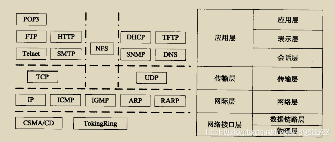

# 第三周

## TODO

### 压机总线板：测试

* AT的UDP代码通读
* 第一次观测：25/2/10

### 无线螺丝刀：DCDC

* 文档、状态图、代码审核
* 上下管控制逻辑修改

### 脉冲工具：ADC

* NADC24D003FA
* ZJC2011: 驱动调通

### PlantUML

* 学习状态机绘制与PlantUML语法

## 2.10 周一

* [x] 读总线状态并创建文档: 全部正常
* [x] 编写ZJC2011驱动
* [x] 学习状态机画法与[PlantUML语法](https://plantuml.com/zh/state-diagram#b99e918943f68545)

## 2.11 周二

* [x] 脉冲工具预研总结
  * 非回弹冲击结构：弹簧式脉冲工具/油压式脉冲工具
  * 回弹冲击结构
* [x] ZJC2011正确采集
  * 硬件有PGA, 放大127.666倍
* [x] 西门子PLC代码修改
  * 默认名为leetx

## 2.12 周三

* [x] 无线动态传感器预研评审会
  * 4位CRC校验不可靠，使用8位CRC
  * 每帧3字节，变为每帧4字节（一字节帧头+一字节CRC+两字节数据）
  * 最后验证
    * 每帧4字节，发送频率3K（对应数据率120KBps）
    * 波特率：150K（使用120K波特率，CPU无时间反应）
    * 8位CRC（4位CRC校验不可靠）
    * 误码率：约百万分之一（运行50分钟）
* [ ] 压机总线AT-UDP代码通读
  * RJ45, PHY, mac
  * RMII
* [x] DCDC, 通讯延时70us
* [x] 无线动态传感器: 新版无线工具
  * 转发到ip: 192.168.30.145
  * 分配ip: 10.3.9.66

## 2.13 周四

* [x] 无线动态传感器误码率测试
* [ ] 脉冲工具专利

## 2.14 周五

* [x] DCDC测试: 不同压摆率下，空载升压的输入电流大小，测试到24A(30A*0.8)停止
* [x] DCDC测试：打8N·M
* [x] DCDC程序修改: 删去Flash内容，对寄存器的配置实时使用
* [x] 总线测试：NetX90版本未更新，将十个板子全部重烧，重启实验

# 第四周

## 2.17 周一
* [x] DCDC: 加入未配置状态，等待1176的配置参数
* [x] 压机采集板: 
  * 问题描述：不PGA放大连传感器有跳动，PGA放大时连传感器无跳动，按压传感器有值输出。
  * 需求：硬件图，配置对比
  * 结论：原程序单极性采样，改为双极性后，不按压采样值为负。
* [ ] 规范开发
  * 项目名(命名规范), 版本号
* [x] 压机总线板测试: codesys测试代码理解并修改
* 代码阶段性提交
  * [x] AT32-SPI2UDP-proj
  * [x] at32f407_spi_with_rk3568-ad7190
  * [x] anybus
  * [x] DCDC
  * [ ] RS485Encoder
* [x] NADC24D003FA: 96Ksps采样率验证
  * 48K能稳定

## 2.18 周二
* [x] 压机总线版: anybus2spi版本监控
* [x] DCDC测试: 压摆率设置与实际表现
* [x] 压机总线版：git出错，ST版代码重新测试
* [ ] DCDC: 识别电池型号
* [x] 无线动态传感器: 小板程序
  * crc8-50K-1K-采样.hex
  * crc8-50K-1K-固定.hex
  * crc8-50K-1K-递增.hex
* [x] DCDC: 刹车时电压异常

## 2.19 周三
* DCDC测试
  * [x] 系统寄存器数据是否实际使用
  * [x] 保护寄存器数据是否实际使用
  * [x] 过压保护
  * [x] 欠压保护
  * [ ] 过流保护: 保护点无法更改
  * [ ] 过温保护: 保护曲线&保护点
  * [x] 清错
* [x] DCDC代码优化: 显示值与使用值使用函数来转换
* [ ] DCDC代码优化: ComM7Register
* [x] DCDC温度标定
  * 28.7  3645
  * 92.2  1721
  * -0.03394*3645 + 151.3586 = 27.6473
  * -0.03394*1721 + 151.3586 = 92.9478
  * -0.033
  * 149.00016
* [x] 查看无线动态传感器测试报告

## 2.20 周四
* [x] DCDCv0.4.0: 待M7配置完寄存器后(11个)，保护与控制模块开始工作
* [x] DCDCv0.4.1: 新版控制代码
* [ ] 压机总线: 测试代码开发：邮箱发送等
* [x] DCDC测试方案
  * 启动100次，测试M7配置寄存器的可靠性
  * 过压保护

## 2.21 周五
* [x] ADC测试环境搭建
* [x] NADC24D003FA高采样率测试
* [x] NADC24D003FA与AD7190采样效果对比

# 第五周

## 2.24 周一
* [x] NADC24D003FA与AD7190对比报告
* [x] 压机总线测试
  * UDP103不输出UDP数据（记录，未找到原因）
* [x] 压机总线：ARP代码
* [x] DCDC电流
* [x] 浅复习计算机网络
  * 数据链路层帧头：目的MAC，源MAC，网络层协议(IPv4, ARP)
  * 网络层帧头：传输层协议(UDP, TCP)
  * 传输层帧头：源端口，目的端口
  * 应用层数据

## 2.25 周二
* [x] NADC24动态特性验证
* [x] ADC的有效位数计算
  * 有效位数=(db-1.76)/6.02
  * https://blog.csdn.net/cusichidouren/article/details/131356209
  * https://zhuanlan.zhihu.com/p/659688858
* [x] 压机总线: 又一台出问题，检查后为codesys不发数据

## 2.26 周三
* [x] NADC24脉冲工具测试
  * 48K没采到最大值
* [x] 验证NADC24的48K采样
  * 485通讯约32K帧每秒, 波特率7.5M
  * 通讯过程: 1176发送3字节, F405回复10个字节
  * 接收字节，如果接收到3字节，crc验证，通过则发送485帧，
* [ ] 基于DMA的SPI实现ADC数据的读取
  * SPI句柄调用DMA句柄，使用双DMA开始传输，DMA接收中断
  * RX的DMA中断没有激活, 原因是CS提前拉高了, 调整到DMA接收完成中断中拉高
  * 注释掉485部分，SPI传输无问题
  * 打开485传输，SPI数据有问题
* [x] DCDC测试流程

## 2.28 周五
* [x] 3568测试
* [x] NADC24评审