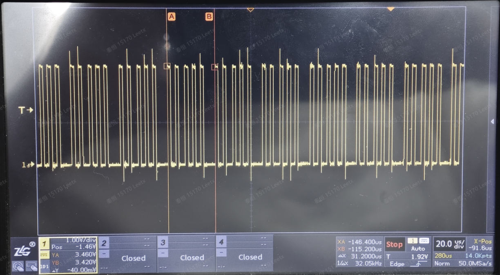

# 第二周

## 4/7 周一
* [x] 一代压机三代总线测试D
  * 使用codesys跑EIP
  * 可以扫到设备，但设备描述符不对，待蔡回
  * 完成codesys跑EIP程序
* [x] 一代压机三代总线测试C
  * 检查正常
* [x] 高采样率ADC数采板优化A
  * 去除所有DMA中断
* [x] 高采样率ADC数采板优化B
  * 串口空闲中断：3.2us
  * 串口发送完成中断：0.4us
  * 串口空闲中断到串口发送完成中断：13.3us
  * 串口发送完成中断到串口空闲中断：14.5us
  * 不使用定时器1，在空闲中断中采样两次，发送完成中断中采样三次
  * 实现32K*5=160K采样率

## 4/8 周二
* [x] 一代压机三代总线测试D
  * 完成搭建
* [x] 高采样率ADC数采板优化C
  * 只保留串口空闲中断
* [x] 新高采样率ADC数采板测试
  * 程序烧录，查看功能是否正常
  * 新版输入短接抖动30
* [ ] DCDC带载升压
  * 难点: 负载对DCDC启动过程形成干扰，而DCDC的电压稳定性又直接影响负载（电机）启动的成功与否，这是一个双向耦合的系统控制问题。
  * [无刷电机](https://zhuanlan.zhihu.com/p/265072304)

## 4/9 周三
* [ ] 脉冲工具原型机运行
* [x] 马头无线脉冲工具实验

## 4/10 周四
* [x] AD4011验证
  * 配置寄存器成功，但采样有问题（正弦波采样成类似方波）
  * ADC采样成功，但仪表放大器需要更改

## 4/11 周五
* [x] 马头脉冲工具说明书
  * 7. 编程设置
    * 参数
      * 7.3.3.3 循环参数（脉冲模式）
        * 最终速度（扭矩，扭矩+转角，转角+扭矩）
        * 运行速度（扭矩，扭矩+转角，转角+扭矩）
    * 7.3.5 对参数进行编程设置
      * 7.3.5.1 搜索序列阶段：使螺栓头插入套筒
      * 7.3.5.2 缓冲转速阶段：
      * 7.3.5.3 最终转速阶段：
      * 7.3.5.4 异常结果响应动作阶段：
      * 7.3.5.5 反向转速阶段：
      * 7.3.5.6 电机参数(标准模式)：
      * 7.3.5.7 电机参数(脉冲模式)
        * 左旋/右旋
        * 转速
        * 加速度
        * 带宽调节
        * 脉冲指令振幅
        * 能量
      * 7.3.5.8 跳转阶段：
      * 7.3.5.9 预紧扭矩阶段：用于监视螺钉或螺母的负载力矩（预紧扭矩）
      * 7.3.5.10 同步等待阶段：
    * 疑问
      * 该作业阶段到下一作业阶段之间的间隔时长：此时状态？
  * 11. 拧紧作业策略指导
    * 11.1 扭矩控制策略
      * 11.1.1 正常模式（连续）
      * 11.1.2 脉冲模式（混合动力）
    * 11.2 配合转角监视的扭矩控制策略
      * 11.2.1 正常模式（连续）
      * 11.2.2 脉冲模式（混合动力）
    * 11.3 配合扭矩监视的转角控制策略
    * 11.4 工具头部上紧检测
      * 11.4.1 主阶段：工具头部上紧检测
      * 11.4.2 主阶段：头部工具上紧之后
    * 11.5 堵转扭矩控制型拧紧作业
    * 11.6 预紧扭矩控制策略
    * 11.7 旋松作业-配合转角监视的扭矩控制策略
    * 11.8 旋松作业-配合扭矩监视的转角控制策略
* [ ] 设计控制策略
  * 疑问A
    * 快速下旋，到达落座扭矩，可以撤去电流，可以反拉电流
    * 当撤去电流，此时速度不为0，会继续弹性形变，随后反弹，实现敲击块与敲击对象的分离
    * 当反拉电流时，相比撤去电流，弹性形变减轻，但会加速回拉，实现敲击块与敲击对象的分离
    * 故一定会分离
  * 疑问B
    * 快速下旋，到达落座扭矩之前，转速的变化
    * 到达落座扭矩之前，阻力变大，加速度变负，速度减小
    * 速度减小，反电动势减小，电流变大，扭矩增大，加速度增大，达到平衡

# 第三周

## 4/14 周一
* [ ] 计划表
  * 控制逻辑实现
  * 验证采集板性能：主要是扭矩采样
  * 控制方案设计
  * 程序编写
    * 下旋到脉冲的阶段切换
    * 脉冲
  * 工艺测试与参数优化

## 4/18 周五
* [x] 总线测试检查
* [x] 脉冲工具初步敲击
* [ ] 以 20N·M, 0.4mV/V 的参数更改 SensorTorque
* [ ] 