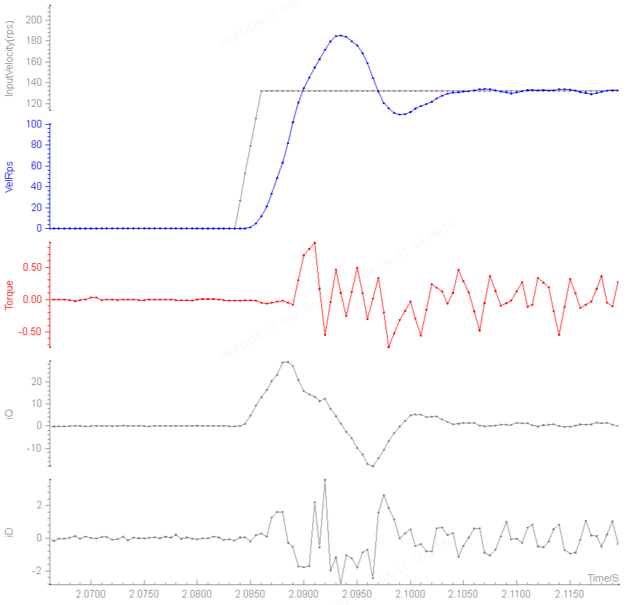
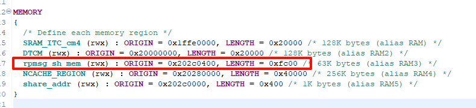
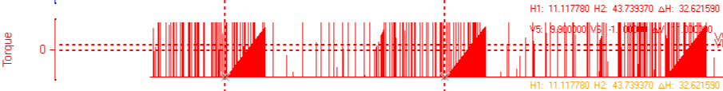
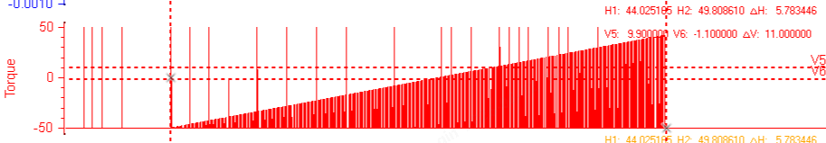

# 2026年6月

## 8号，星期一

### 无线脉冲50Nm调试
* 485通讯有时会在转完后，crc持续增长，导致无法使用，重启后又恢复正常，不转时错误不增长

### 有线脉冲错误码表V1.1.0更新说明
* 新增1142: 读取工具数据失败
* 新增1143: 读取控制器伺服参数失败

### 有线脉冲下位机V0.4.7.9更新说明
1. 脉冲工艺
   * 减小了core1控制时的刹车电流，避免报过流错
   * 反松完成后，使用下旋电流&下旋加速度，避免上大电流
   * 拧紧&反松时，反敲速度不足时，使用下旋电流&下旋加速度，避免上大电流
2. 将调试的默认扭矩限制改为3.0
3. FSM初始化等待时间由15秒减少为10秒
4. 控制器EEPROM相关操作删去boot，该部分仅在网口烧录时使用
5. 区分下旋速度最大值与脉冲速度参数最大值，新增脉冲最大速度参数，加入TigtenAssembly组中
6. 优化了保存加载EEPROM操作，成功失败SDO都会跳转到对应值，失败会报错
7.  自动工艺更新
  * 确定了与目标扭矩适配的拧紧起始扭矩、碰撞扭矩、扭矩阈值
  * 将下旋初速系数、脉冲初速系数、初段增速系数、终段增速系数确定为EEPROM系数，加入pulse组中
8.  错误码更新
  * 弃用1141: 读取伺服数据失败
  * 新增1142: 读取工具数据失败
  * 新增1143: 读取控制器伺服参数失败
  * 新增1144: 保存工具数据失败
  * 新增1145: 保存控制器伺服参数失败
  * 新增1146: 加载工具数据失败
  * 新增1147: 加载控制器伺服参数失败

### 有线脉冲出厂参数V0.1.2更新
1. TigtenAssembly组, 新增参数 0x500013[脉冲最大速度], PHP.025初值11880, PHP.050初值17500
2. TigtenAssembly组, 修改参数 0x500011[电机最大正向转速(RPM)], PHP.025初值18480, PHP.050初值21000
3. TigtenAssembly组, 修改参数 0x500012[电机最大正向转速(RPM)], PHP.025初值18480, PHP.050初值21000
4. TigtenAssembly组，修改参数 0x500032[ToolType], 参数名修改，参数类型修改为U32，参数长度修改为4
5. Pulse组, 新增参数 0x600131[默认下旋速度比例], PHP.025初值 0.75, PHP.050初值 0.55
6. Pulse组, 新增参数 0x600132[默认脉冲初速比例], PHP.025初值 0.75, PHP.050初值 0.55
7. Pulse组, 新增参数 0x600133[默认初段增速比例], PHP.025初值 0.02, PHP.050初值 0.02
8. Pulse组, 新增参数 0x600134[默认终段增速比例], PHP.025初值 0.01, PHP.050初值 0.01
9. 将所有Str数据类型改为str

## 9号，星期二

### 有线脉冲错误码表V1.1.1更新说明
* 新增1144: 保存工具数据失败
* 新增1145: 保存控制器伺服参数失败
* 新增1146: 加载工具数据失败
* 新增1147: 加载控制器伺服参数失败

## 10号，星期三

### 有线脉冲PLM文档
* 一轮自测汇总报告，汇了一上午，主要是上位机的测试报告是word的，最后把报告全部截图插到Excel的汇总报告当中

### 有线脉冲下位机V0.4.7.10更新说明
1. 优化了保存、加载EEPROM的逻辑，连续保存时失败立刻退出
2. 修复了反转源与启动源耦合的问题
3. 工艺文件不存在的错误码由 0x4086 改为 0x2212
4. 移除了扭矩系数在主循环中更新的逻辑
5. 将所有sequence中拿不到的数据，都放到脉冲结构体中拿取，新增相关的七个SDO参数
6. TODO: 测试ec_app.cc中thread_direction的作用
7. 优化sequence
   1. 脉冲工艺最大速度、最大反转速度、工具扭矩、减速比、扭矩计算相关系数，在开机时被赋值
   2. 扭矩计算相关系数、拧紧ID、反转目标速度在FSM上电状态时赋值

### Tighten-Control-Core-Sequence仓库
1. 删去原有的pulse分支
2. 基于customize/hoymiles分支，创建pulse/wireless分支
3. 移植时修改点
   1. 急停按下，不使用 EmergencyStop

### 无线拧紧工具移植时修改点
1. FSM上电时更新全部扭矩系数
2. 全局标定系数不区分脉冲与拧紧
3. json_flag为真时运行机箱设置原有工艺，为假时运行脉冲工艺
4. 没有移植单步持续拧紧相关代码

### 无线脉冲能力测试
- 问题1：速度超调严重
  - 

### 无线脉冲M4调试
- EWT0.1.0-a.3+dev1: 回调函数地址与结构体变量地址获取，在目标地址内
  - 
  - 
- EWT0.1.0-a.3+dev2: pulse_m4_p 获取后，马上extreme_direction写1
- EWT0.1.0-a.3+dev3: ec_master_period_data_in 中获取扭矩，扭矩数据不符合预期
  - 
  - 
  - 
- EWT0.1.0-a.6+dev2: coe_output写0x12345678，pulse_m4_p得到的是0x12345600
- M4程序一调用回调，就会导致跳转失败