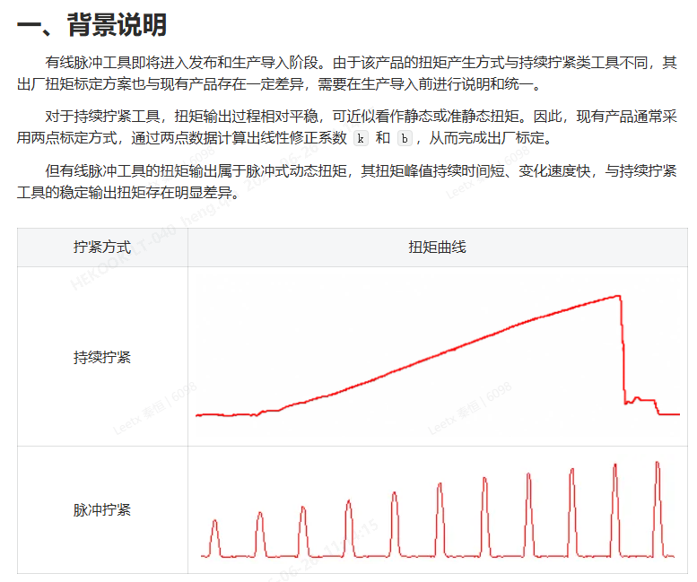
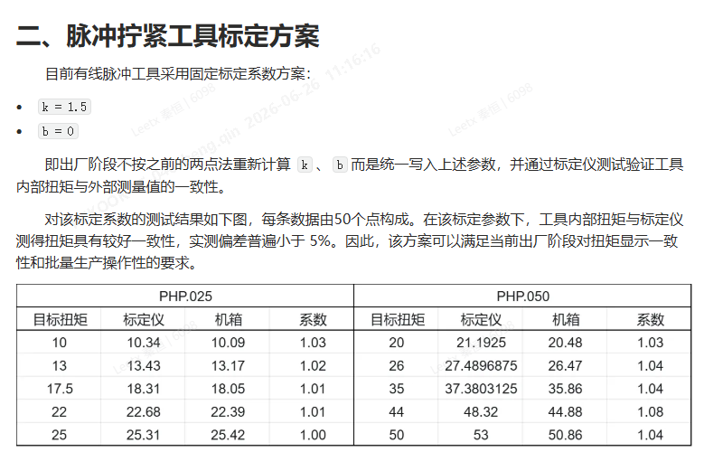
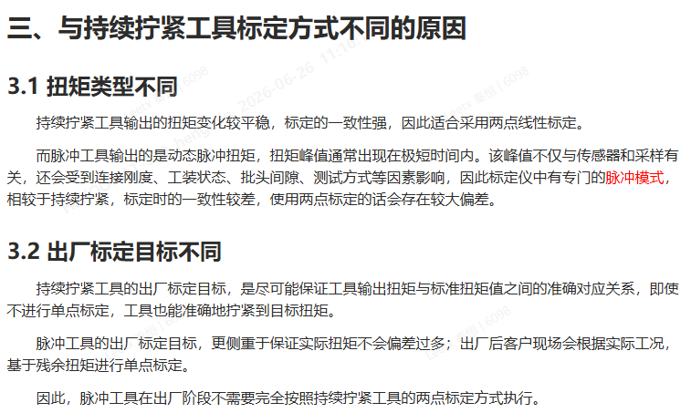
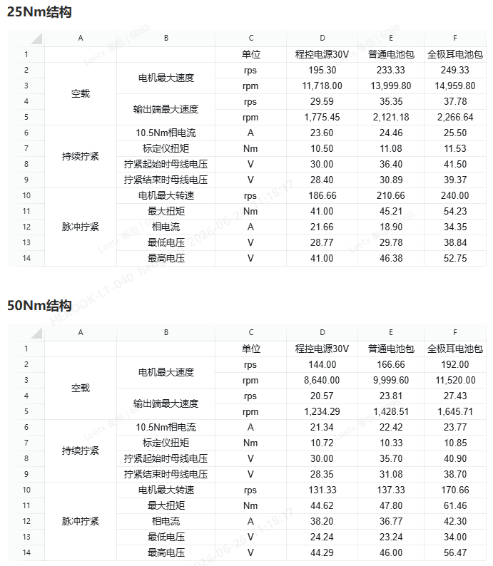

# 2026年6月

## 8号，星期一

### 无线脉冲50Nm调试
* 485通讯有时会在转完后，crc持续增长，导致无法使用，重启后又恢复正常，不转时错误不增长

### 有线脉冲错误码表V1.1.0更新说明
* 新增1142: 读取工具数据失败
* 新增1143: 读取控制器伺服参数失败

### 有线脉冲下位机V0.4.7.9更新说明
1. 脉冲工艺
   * 减小了core1控制时的刹车电流，避免报过流错
   * 反松完成后，使用下旋电流&下旋加速度，避免上大电流
   * 拧紧&反松时，反敲速度不足时，使用下旋电流&下旋加速度，避免上大电流
2. 将调试的默认扭矩限制改为3.0
3. FSM初始化等待时间由15秒减少为10秒
4. 控制器EEPROM相关操作删去boot，该部分仅在网口烧录时使用
5. 区分下旋速度最大值与脉冲速度参数最大值，新增脉冲最大速度参数，加入TigtenAssembly组中
6. 优化了保存加载EEPROM操作，成功失败SDO都会跳转到对应值，失败会报错
7.  自动工艺更新
  * 确定了与目标扭矩适配的拧紧起始扭矩、碰撞扭矩、扭矩阈值
  * 将下旋初速系数、脉冲初速系数、初段增速系数、终段增速系数确定为EEPROM系数，加入pulse组中
8.  错误码更新
  * 弃用1141: 读取伺服数据失败
  * 新增1142: 读取工具数据失败
  * 新增1143: 读取控制器伺服参数失败
  * 新增1144: 保存工具数据失败
  * 新增1145: 保存控制器伺服参数失败
  * 新增1146: 加载工具数据失败
  * 新增1147: 加载控制器伺服参数失败

### 有线脉冲出厂参数V0.1.2更新
1. TigtenAssembly组, 新增参数 0x500013[脉冲最大速度], PHP.025初值11880, PHP.050初值17500
2. TigtenAssembly组, 修改参数 0x500011[电机最大正向转速(RPM)], PHP.025初值18480, PHP.050初值21000
3. TigtenAssembly组, 修改参数 0x500012[电机最大正向转速(RPM)], PHP.025初值18480, PHP.050初值21000
4. TigtenAssembly组，修改参数 0x500032[ToolType], 参数名修改，参数类型修改为U32，参数长度修改为4
5. Pulse组, 新增参数 0x600131[默认下旋速度比例], PHP.025初值 0.75, PHP.050初值 0.55
6. Pulse组, 新增参数 0x600132[默认脉冲初速比例], PHP.025初值 0.75, PHP.050初值 0.55
7. Pulse组, 新增参数 0x600133[默认初段增速比例], PHP.025初值 0.02, PHP.050初值 0.02
8. Pulse组, 新增参数 0x600134[默认终段增速比例], PHP.025初值 0.01, PHP.050初值 0.01
9. 将所有Str数据类型改为str

## 9号，星期二

### 有线脉冲错误码表V1.1.1更新说明
* 新增1144: 保存工具数据失败
* 新增1145: 保存控制器伺服参数失败
* 新增1146: 加载工具数据失败
* 新增1147: 加载控制器伺服参数失败

## 10号，星期三

### 有线脉冲PLM文档
* 一轮自测汇总报告，汇了一上午，主要是上位机的测试报告是word的，最后把报告全部截图插到Excel的汇总报告当中

### Tighten-Control-Core-Sequence仓库
1. 删去原有的pulse分支
2. 基于customize/hoymiles分支，创建pulse/wireless分支
3. 移植时修改点
   1. 急停按下，不使用 EmergencyStop

### 无线拧紧工具移植时修改点
1. FSM上电时更新全部扭矩系数
2. 全局标定系数不区分脉冲与拧紧
3. json_flag为真时运行机箱设置原有工艺，为假时运行脉冲工艺
4. 没有移植单步持续拧紧相关代码

### 无线脉冲能力测试
- 问题1：速度超调严重
  - 

### 无线脉冲M4调试
- EWT0.1.0-a.3+dev1: 回调函数地址与结构体变量地址获取，在目标地址内
  - 
  - 
- EWT0.1.0-a.3+dev2: pulse_m4_p 获取后，马上extreme_direction写1
- EWT0.1.0-a.3+dev3: ec_master_period_data_in 中获取扭矩，扭矩数据不符合预期
  - 
  - 
  - 
- EWT0.1.0-a.6+dev2: coe_output写0x12345678，pulse_m4_p得到的是0x12345600
- M4程序一调用回调，就会导致跳转失败

# 第三周
## TODO
### 有线脉冲
#### 紧急
- [x] 测试 V0.4.8-a 功能
- [x] 确定了PHP.025, PHP.050的最大速度，1800与2200rpm
- [x] 参数：EEPROM参数写失败后重写、陀螺仪标定
- [x] 测试 V0.4.8-b 功能
- [x] 自动工艺上位机文档
- [x] 结果码：结果码与分布结果中的fail_code有差异（设计如此）
- [x] 自动工艺完成后，发送工艺参数json
- [x] 移植二代修改项，分析二代缺陷
- [x] 更新固件烧录与出厂参数设置文档
### 无线脉冲
- [x] 寻找回调函数无法成功启动的问题
- [x] 25Nm工具测试
- [x] 50Nm工具测试
- [x] 机械组测试需求

## 15号，星期一
### 工艺结果生成逻辑分析
- fail_code 在工艺结果与分步结果分别有一个，现在碰见的问题为工艺结果与分步结果错误码不相同
- 分步结果的 fail_code 在sequence 中为 error_code
  - AssessResult 函数的输入参数 error_code 是u16的，工步的错误码是 u32 的
  - bit17: 小于扭矩下限
  - bit18: 大于扭矩上限
  - bit19: 小于角度下限
  - bit20: 大于扭矩上限
  - bit21: 全局角度低失败
  - bit22: 全局角度高失败
- 分步结果的错误码最终会赋值给result json分布结果中的 fail_code
- 工艺结果的错误码, 由 temp_result.fail_code 确定，发现在收到工步停止信号后，对结果码做了一个0xFFFF的与操作，相当于删去了扭矩与角度的评估
- 最后，在 result_to_cjson 函数中 temp_result 中的内容转换为json格式

### 无线脉冲回调调试
- 发现回调函数与M4的变量定义有冲突，将回调函数定义在0x202C8000
- 回避了回调功能，直接将函数定义在M4核，实测可运行

### 有线脉冲下位机 V0.4.8-a 更新说明
1. 优化了保存、加载EEPROM的逻辑，连续保存时失败立刻退出，全部保存操作中，每保存一段等待1秒
2. 修复了反转源与启动源耦合的问题
3. 工艺文件不存在的错误码由 0x4086 改为 0x2212
4. 移除了扭矩系数在主循环中更新的逻辑，恢复了重启才重新加载扭矩系数的逻辑
5. 优化 sequence
   1. 将脉冲所有相关参数，全都放到脉冲结构体 sPulseContext 中
   2. 脉冲工艺最大速度、最大反转速度、工具扭矩、减速比、扭矩计算相关系数，在开机时被赋值到 pulse_ctx 当中
   3. 机箱标定系数Amend_k、拧紧ID、反转目标速度，在FSM状态机上电状态时赋值到 pulse_ctx 当中

## 16号，星期二
### 有线脉冲下位机 V0.4.8-b 更新说明
1. 重写了陀螺仪代码，tmp_offset持续使用原始值计算偏差，用于标定
2. 修复了 torque_global_calibration_gain 没有实际赋值的 BUG

### 有线脉冲下位机 V0.4.8-c 更新说明
1. 新增SDO: 0x100180，用于维保锁枪机制

## 17号，星期三
### 有线脉冲下位机 V0.4.8-d 更新说明
1. 默认拧紧次数从-1改为0
2. 新增了 AutoPsetDone 的 json 指令
3. 自动工艺结束后，工艺参数来源改为json

## 17号，星期三
### 无线脉冲测试需求
1. 测一下电池的母线电流/相电流，（dc-dc功能阉割，无传感器不支持监测线电流）。相电流等于线电流
2. 测一下持续拧紧10nm（避专利），电流大小；脉冲25NM,电流大小
3. 看一下电机能力，最大能拉升多少nm。
4. 空载最高转速
5. 电源供电-27V/最高转速
6. 空载/低电压脉冲，会不会死机

# 第四周

## TODO

### 有线脉冲

- [x] 追加脉冲
- [x] 扭矩失效报警：工艺保护、扭矩数据不更新
- [x] 反松失败报警：反松成功后，扭矩仍出现大于反松碰撞扭矩，返回反松状态
- [x] littlefs更新
- [x] 扭矩失效报警测试，新增错误码: 0x0800, 0x0801, 0x0802
- [x] 持续拧紧电流指令测试
- [x] 电流指令测试
- [x] 脉冲参数测试：速度超调问题[加速度偏大，加上角度补偿，综合下来可削减超调量]
- [x] 参数json修改，版本V0.3，修改了PHP.025的自动工艺参数
- [x] 参数json修改，版本V0.4，修改了电流指令
- [x] 固件升级与参数写入文档更新：压缩包体现了里面固件的版本号
- [x] 修改上位机新建工艺时与目标扭矩的关系，使其更适用于最小目标扭矩5Nm的情况
- [x] 持续拧紧参数公式
- [x] 进入自动工艺时，在FSM中各记录值清零
- [x] json_params_enable参数有点危险，一旦中通退出，json_params_enable没有置1，机箱参数就失效了，将json_params_enable设置全部在放FSM中
- [x] 先辑APP+BOOT
- [x] 自动工艺测试，解决已知BUG
- [x] 上位机更新错误码表V1.1.1
- [x] 错误码：下位机时间错误[该问题给了上位机]
- [ ] 测试ec_app.cc中thread_direction的作用

### 无线脉冲
- 30V程控电源，普通电池，全极耳电池，测试
  - [x] 持续拧紧
  - [x] 脉冲拧紧
  - [x] 空载转速

## 22号，星期一

### 有线脉冲下位机 V0.4.8-e 更新说明
1. 追加脉冲的强度同默认脉冲初速系数，工艺json加入ExtraPulse字段
2. 反松判断完成后，如果扭矩仍出现大于反松扭矩阈值，重新进行反松，以避免上大电流

### 扭矩异常分析
- 分析背景
  - 脉冲工艺中，一旦扭矩数据丢失，可能会出现较危险的情况
  - 例如持续上大电流，导致工人手受伤
- 异常情况分析
  - 传感器坏[传感器量程为工具量程的两倍，理论上不会坏]
  - 信号线断，扭矩仍抖动，但数据失去意义[工艺保护]
  - 数采板ADC坏，扭矩不更新[在FSM中检查扭矩更新]
  - 数采板通讯丢失[伺服报错]
- 脉冲
  - 下旋阶段
    - [x] 这个阶段比较麻烦，只能通过限制电流来实现防止受伤
    - [x] 转换为脉冲阶段时的反转限制为小电流
  - 脉冲阶段
    - [x] 加速阶段用大电流，限制加速时间
    - [x] 低速反转限制为小电流

### 电流指令不起效分析
- 持续拧紧
  - 为什么电流指令不起作用？发现持续拧紧电流指令给的都是500，对应15A，但iQ可以出到60A
  - 检查core1端 电流限制
  - 发现电流指令1对应10A电流，300的实际电流指令
  - 相当于之前电流指令就没对过
- 分析
  - 相应的，这个改动会带来一些问题
  - 首先是下旋时，电流限制住的话，没法通过加电流的方式过扭矩阈值，这个问题理论上比较吹毛求疵，因为高扭矩对应高拧紧起始扭矩，也对应高下旋速度
- BUG
  - 限制了电流，持续拧紧，反转时，无法超出
  - 持续拧紧快速下旋碰撞时有问题

### 有线脉冲下位机 V0.4.8-f 更新说明
1. 新增扭矩丢失时的保护，包括扭矩不更新和扭矩数据失效
2. 重写了工艺对Motion库调用部分，分为大电流、小电流、无电流、刹车等控制模式
3. 更新了littlefs，加快了FLASH读写速度
4. 解决了持续拧紧下旋过冲时，控制权未切回PDO的问题
5. 脉冲拧紧与反松使用脉冲扭矩系数，持续拧紧使用1
6. 错误码
   1. 0x0801: 脉冲阶段加速超时
   2. 0x0802: 脉冲阶段回弹超时
   3. 0x0803: 下旋阶段大电流超时

## 24号，星期三

### 有线脉冲参数V0.1.3
1. PHP.025
   1. 电机最大转速、脉冲最大转速都为11880
   2. 脉冲电流指令上限改为9，下旋电流指令上限改为3
   3. 默认下旋速度比例、默认脉冲初速比例改为0.7
2. PHP.050
   1. 电机最大转速、脉冲最大转速都为15400
   2. 脉冲电流指令上限改为9，下旋电流指令上限改为3

### 有线脉冲下位机 V0.4.8-g
1. 将json_params_enable设置全部在放FSM中，禁用SDO直接修改，改为间接通过0x6001B2修改
2. 新增tool文件夹，包含了将Boot和App打包的脚本

### 无线脉冲测试
- 问题
  - M4核控制时，内外转速对的上
  - M7核控制时，实际转速是内部示数转速的2/3

## 25号，星期四

### 有线脉冲下位机 V0.4.8-h
- 自动工艺
  - 启动后状态清零
  - 完成后锁枪，退出自动工艺后解锁
  - 调参次数不会到3
  - 断电时，解除锁枪

## 26号，星期五

### 扭矩标定方案情况说明
- 
- 
- 

### 分析无线脉冲工具测试数据
- 
- 首先是撤电流阶段，电压电流会明显升高，且分成两段，一段是自由滑行，一段是减速
- 问题：对于一款电机，单位电流的加速能力越大，单位电流输出扭矩能力也越大吗？
  - 单位电流加速能力 = 单位电流产生的扭矩(扭矩常数Kt) / 等效转动惯量
  - α/Iq = Kt / J
  - 等效为：a = F / m
- 问题：在实际电机设计及制造时，单位电流产生的扭矩与等效转动惯量有关系吗，比如为了获取更大的单位电流产生的扭矩，必须增加等效转动惯量？
  - 单位电流产生的扭矩 Kt 和等效转动惯量 J 没有必然绑定关系，提高 Kt 不一定必须增加 J
  - 增加Kt
- 问题：单位电流产生的扭矩与电机的哪些参数有关？
  - 绕组匝数

# 第五周

## 待办

### 有线脉冲

- [x] 反松碰撞扭矩  截止: 2026-06-29
- [x] 保护参数  截止: 2026-06-30
- [x] 脉冲与持续拧紧标定系数代码修改  截止: 2026-06-30

## 20260630 周二

### 有线脉冲出厂参数V0.1.4
- 新增"脉冲反松起始扭矩"，映射的SDO为0x600135
- 新增"脉冲工艺扭矩系数"，映射的SDO为0x600138
- "全局标定k"映射的SDO由0x200326更改为0x600136，默认值改为1
- "全局标定b"映射的SDO由0x200325更改为0x600136

### 有线脉冲下位机 V0.4.9-a
1. 脉冲反松工艺区分了反松起始扭矩与反松碰撞扭矩，都存储在把手EEPROM中
2. 区分了持续拧紧与脉冲拧紧的全局标定系数，脉冲工艺启用脉冲拧紧全局标定系数
3. ComSource: OP控制时，过1秒控制源自动清零
4. 解决OP控制时，写Result_Picked失败报0x5012的问题
5. EEPROM更改
  - 新增反松起始扭矩
  - 新增脉冲扭矩全局标定系数
  - 修改了持续拧紧全局标定系数k映射的变量
  - 修改了持续拧紧全局标定系数b映射的变量
- 自测项目
  - [x] 持续拧紧
  - [x] 标定系数激活情况
  - [x] OP控制，0x5012错

### 有线脉冲下位机 V0.4.9-b
1. 启用 checkSensorValid 函数，用于监控温度与扭矩原始数据是否正常
2. 更新刷新IO输出映射逻辑
3. 修改了0x2249, 0x0800, 0x0801, 0x0802错误码的触发条件，全部修改为1秒