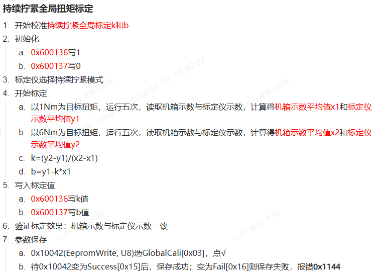
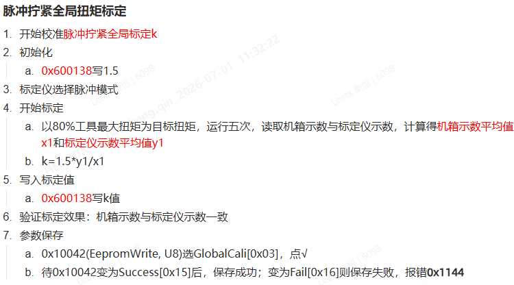

# 2026年七月

# 第一周

## 待办

- [x] 有线脉冲：出厂参数V0.1.4  截止: 2026-07-01
- [x] 有线脉冲：脉冲与持续拧紧标定系数方案文档  截止: 2026-07-01

## 20260701 周三

### 有线脉冲标定方案
- 
- 

### 脉冲工具：等效惯量计算
- 碰撞转速、峰值扭矩、碰撞时长、转动惯量建模
  - 解决多少转速、多少惯量足够的问题
  - 为了简化模型，按拧紧时碰撞时长6ms分析
  - 动量定理：F·Δt=m·Δv
  - 角动量定理：T·Δt=J·Δω，∫T(t)dt=JΔω
  - 计算25Nm结构等效转动惯量
    - 30V程控电源数据
      - 平均扭矩：T=41/2 Nm = 20.5 Nm
      - Δt=6ms
      - Δω=(140*1.662)/6.6=35.25rps=35.25*2π ​rad/s = 221.4 ​rad/s
      - J=20.5*0.006/221.4 kg⋅m2= 5.56e-4 kg⋅m2
    - 普通电池包数据
      - 平均扭矩：T=45.21/2 Nm = 22.605 Nm
      - Δt=6ms
      - Δω=(158*1.6395)/6.6=39.25rps=39.25*2π ​rad/s = 246.487 ​rad/s
      - J=22.605*0.006/246.487 kg⋅m2= 5.5e-4 kg⋅m2
    - 全极耳数据
      - 平均扭矩：T=54.23/2 Nm = 27.115 Nm
      - Δt=6ms
      - Δω=(180*1.626)/6.6=44.345rps=44.345*2π ​rad/s = 278.487 ​rad/s
      - J=27.115*0.006/278.487 kg⋅m2= 5.842e-4 kg⋅m2

### 无线脉冲：电池
- 电压降低对最大转速的影响
  - 电池电压补偿
  - 低电压降额
  - 电池温度保护
  - 电池内阻/压降评估
  - 低电量禁止高扭矩工艺
  - 充电

### 观测器
- 培训了一下现代控制理论中的线性观测器
- 说白了就是先对被控系统建模，然后优化模型参数，直至模型输出的值与现实值一致
- 优化好的模型可以作用于后续的MPC
- 思想基本上与深度学习一致

## 20260702 周四

### 无线脉冲
- 计算电流与扭矩的关系时，总也对不上
- 首先发现扭矩传感器系数有变化，从26.4mV/A变为13.3mV/A
- 其次iQ是峰值相电流，供应商给的转矩常数是0.0284N·m/A，之前测试结果是有效电流，也就是峰值相电流/1.414

### 周五

### 有线脉冲下位机 V0.4.9-b
1. 修改了脉冲新增报警的触发阈值，全部改为1秒
2. 重新启用了 checkSensorValid 函数
3. 在2k中断中刷新IO输出映射

### PHP.025_V0.1.5
0. 更改版本号与日期
1. 加速度（rps/s）[0x800323]: 5000->50
2. 最大加速度（rps/s）[0x800326]: 30000->75000
3. 堵转电流阈值[0x800332]: 20->40
4. 堵转速度阈值（电频率）[0x800333]: 1->5
5. 速度限制(RPS)[0x800407]: 350->500
6. 驱动器最大输出频率[0x80040A]: 1500->2000
7. 全局标定k[0x600136]: 改名“全局标定k[持续]”
8. 全局标定b[0x600137]: 改名“全局标定b[持续]”

### PHP.050_V0.1.5
0. 更改版本号与日期
1. 加速度（rps/s）[0x800323]: 5000->50
2. 最大加速度（rps/s）[0x800326]: 30000->75000
3. 堵转电流阈值[0x800332]: 20->40
4. 堵转速度阈值（电频率）[0x800333]: 1->5
5. 速度限制(RPS)[0x800407]: 350->500
6. 驱动器最大输出频率[0x80040A]: 1500->2000
7. 全局标定k[0x600136]: 改名“全局标定k[持续]”
8. 全局标定b[0x600137]: 改名“全局标定b[持续]”

# 第二周

- [ ] 无线脉冲：分析数据  截止: 2026-07-02
- [ ] 有线脉冲：分析生产的测试数据  截止: 2026-07-02
- [ ] 有线脉冲：代码增加计算等效转动惯量的逻辑
- [ ] 有线脉冲：智能工艺新增参数：节拍

## 20260706 周一

### 有线脉冲：标定相关参数关系汇总
- 持续拧紧全局标定系数k: 以0x6001为主，存在EEPROM中，FSM的上电状态更新到2003当中
- 持续拧紧全局标定系数b: 以0x6001为主，存在EEPROM中，FSM的上电状态更新到2003当中
- 脉冲拧紧全局标定系数k: 以0x6001为主，存在EEPROM中，FSM的上电状态更新到2003当中
- 脉冲拧紧全局标定系数b: 固定为0
- 单点标定系数k: 以0x2003为主，存在EEPROM中，FSM的上电状态更新到6001当中
- 输入偏置offset: 以0x2003为主，存在EEPROM中，FSM的上电状态更新到6001当中

### 有线脉冲下位机 V0.4.9-c
1. FSM的上电状态时，输入偏置offset(0x200318)更新到0x60013A当中

### 有线脉冲测试
- 在经历了上周的执行时间有问题导致的速度计算偏差，还有电流灵敏度偏差之后，算是采样的变量算是无问题
- 所以把25的结构重新测试了一下，发现全极耳电池的输出能力确实强一些，比如同样的参数，全极耳能输出70A，而普通电池只有50A
- 接下来需要测电池低电量时的表现：包括电流输出能力、会不会把电池拉死机
- 跟强哥聊了一下，刹车电压拉高是正常的，无线拧紧枪里是靠制动电阻，在电压超过58V时工作，此外有一个比较器比较母线电压和电池电压，避免反灌电流，我测试中电压没抬高那么多是因为加的电容是无线的六倍，而有线里面用的（应该是650W电源）又是现在我用的无线脉冲的六倍，只是后面的板子就又不用这么多电容了，说太占地方
- 实际测下来感觉能力还可以，就是hub的原因，经常出现大脉冲的时候SDO掉