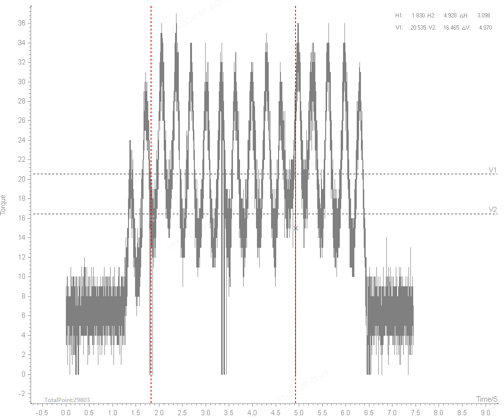
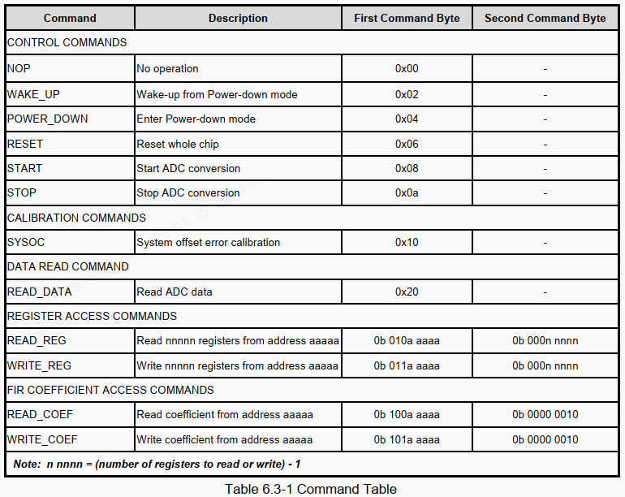

# NADC24D003FA
* 两个示例项目，里面有NADC24的驱动代码
  * http://www.nuvoton-mcu.com/forum.php?mod=viewthread&tid=69190&extra=page%3D2
  * http://www.nuvoton-mcu.com/forum.php?mod=viewthread&tid=69175&highlight=NADC
* 将SPI发送逻辑修改了一下，可以读到ID，但数据感觉不太对，待调整配置过程

# 进度
* 时钟频率:
* 参考电压：
* 校验流程图：P18
* VDD多少
* 首先是发现TM驱动有错，无语了
* REG_ADDR_PWD_CTRL2寄存器
  * MOD_REFN, MOD_REFP
  * PGA_BUFF, PGA
* 问题1✅：Debug运行可以检测到2V左右的内部参考电压输出，但断电后再运行检测不到。
  * 只要与NADC通讯上一次，就可以检测到内部参考电压
* 问题2✅：PGA
  * 放大 1X：接6,308,394，不接-139,268~994,276
  * 放大16X：接6,308,394，不接6,308,806
* 调出来了，是接传感器的座有问题
* 下一步是在485Encoder中调通
* 问题3❌：采集板初始化事件可能有点长，上电后不能直接读取485数据，重新插拔485线也不行，重新烧录程序可以
  * 还没解决
* 问题4✅：4K频率采集，485通信结果，每隔1.5s有一个抖动期，485传输不稳定
  * 
  * 不使用DMA，DMA涉及到中断
* 

# 阅读参考手册
# 6 功能描述
## 6.2 功能描述
### 6.2.1 ADC调制器和数字滤波器
* ADC调制器输出3位数据ADOUT[2:0]，这是数字滤波器的输入。最终输出是一个带符号的24位数据。不同输出数据速率的数字滤波器设置如下所示。
  * ADC_CLK_SET：寄存器
  * OSR_SEL：寄存器
  * FSPS: 采样率
  * CLOCK
  * Fmod：512kHz, 1.024Mhz
  * OSR: ADC Filter Oversampling Rate
  * notes
### 6.2.2 ADC过驱动模式
* NADC24支持过驱动模式，输出数据速率可提高到96kSPS。此模式必须满足以下条件：
  * VDD/AVDD大于3.15V
  * ADC相关电路的偏置电流控制寄存器必须设置为最大值，如VCM_bias_set、MOD_REFP_bias_set、MODI_REFN_bias_SES、PGA_bias_SES、PGE_BUFF_bias_SEL、ADC_bias_SEL、ADC_OP1_bias_set和ADC_OP2_bias_SEP
* 推荐配置
  * CLOCK
  * ADC_CLK_SET：寄存器
  * OSR_SEL：寄存器
  * FSPS
  * Fmod
  * OSR
  * NOTES：建议使用By-pass FIR
### 6.2.3 低噪PGA
* NADC24具有低漂移、低噪声的PGA，为电桥传感器提供完整的预信号放大。必须根据不同的增益配置不同的输入阻抗。为了获得最稳定的值，电阻器必须与传感器的选择精确匹配。
## 6.3 寄存器
* ADC通过多个片上寄存器进行控制和配置，这些寄存器将在以下部分中进行描述。在描述中，set表示逻辑1状态，clear表示逻辑0状态，除非另有说明。
### 6.3.1 spi
* NADC24的通信接口使用SPI通信协议。有四个引脚，SPI_SS、SPIDO、SPIDI和SPI_CLK。SPI在此阶段启动操作。首次通电和断电唤醒需要250us的等待时间才能开始ADC转换。
* SPI_CLK最大速度为20MHz；duty应控制在40/60。SPIDI是数据输入通道。当SPIDI数据处于SPI_CLK上升沿时，NADC24从主设备接收数据。SPI的一帧是8位的，第一帧是命令。命令格式如表6.3-1所示。
### 6.3.2 指令表
* FIR 系数访问命令

### 6.3.3 寄存器表
* PWD_CTRL 1    断电控制
* PWD_CTRL 2    
* DF_CTRL 1     数字滤波器控制
  * OSR_SEL: OSR 1024
* DF_CTRL 2     
* ADC_CTRL      
  * ADC_CLK_SET: 1.024 MHz
* BIAS_CTRL 1   偏差控制
* BIAS_CTRL 2   
* CHOP_CTRL     芯片控制
* BG_CTRL 1     带隙控制
* OSC_CTRL 1    内部振荡器控制寄存器
* OSC_CTRL 2    
  * SEL_INT_OSC_F: 49.152 MHz
* REF_CTRL      内部参考电压控制和1.8V LDO控制
* DAC_DATA 1    
* DAC_DATA 2    
* DAC_CTRL      
* PGA_CTRL 1    
* PGA_CTRL 2    
## 6.5 操作流程图
* 三种状态切换
* 待机模式：Standby mode
  * 设备在待机模式下通电，并在没有正在进行的转换时自动进入此模式。在此模式下，设备未处于活动状态。这允许在收到start命令后立即开始转换。当发送STOP命令时，设备进入待机模式。
* 转换模式：Conversion mode
  * 收到START命令后，ADC无限期转换，直到被STOP命令停止。
  * 在此模式下，用户无法更改任何数字滤波器设置（DF_CTRL）。
* 断电模式：Power-down mode
  * 通过接收Power_down命令进入断电模式。在这种模式下，无论寄存器设置如何，所有模拟和数字电路都会断电以实现最低功耗。所有寄存器值在断电模式下保持当前设置。必须发出WAKE_UP命令才能退出断电模式并进入待机模式。
  * 要将设备从POWER_DOWN中释放，请发出WAKE_UP命令以进入待机模式。然后，设备等待START命令进入转换模式。

* 0x005A2E61
* 