# ZJC2011
## 模式选择
* 繁忙模式会在数字位前强制增加一个繁忙位，变成每次传输17位，这是不想要的
* 先选择三线无繁忙模式实现
## 硬件使用
* 定时器
  * 定时器1：用于产生160K频率的中断，用于ADC采样
  * 定时器2：用于微秒延时，延时完成后有更新中断
  * 定时器6：HAL库Tick
* SPI
  * SPI1：ADC
  * SPI3：位置编码器
* 
## 25/2/10
* 三线无繁忙，引脚与操作
  * SDI(PA7): MOSI, 拉高
  * SCK(PA5): CLK
  * SDO(PA6): MISO
  * CNV(PA4): 上升沿启动转换, 完成转换后, CNV变为低电平, MSB输出至SDO, 剩余数据位在随后的 SCK 下降沿逐位输出
* 读出持续的0x7F
* 电平现象：拉高CNV，过1us拉低CNV，过10ns SDO变为低电平，随后SDO变为高电平，同时CLK开始下降沿
* 电平检测：与说明文档描述一致，且调整SPI波特率，SDO也会响应便会，且输出值一致
* REF：输入参考电压实测0.14V，有问题，修正
* 采样值出现抖动，但拧紧传感器时采样结果没抖动，将数据线扭曲时结果抖动，怀疑**传感器输入输出**有问题
* 此外，传感器输出值较小，其他ADC芯片都可以进行**PGA**放大，但此芯片无此功能，所以分辨率肯定不行
* [x] PGA需要外接，首先将模拟输入给引出，测试采样效果
  * 实际接了PGA放大器，放大约127倍，所以ADC测出0.9V是合理的
* 采样结果：拧扭矩传感器，结果变化不大
  * 不接扭矩传感器，和将信号线弯折一定程度，稳定的值不一致
  * 怀疑是信号线接口没焊好
* 将运放拆下，直接将IN+和IN-引出，发现输出给ADC芯片的电平有问题
* [x] 硬件修改后，ADC测量结果正常
* [x] 运放正常工作
* [x] 三线有繁忙
* [x] 理论计算
  * 波特率: 10.5M
  * 一字节: 8/10.5M=762ns
  * 最低波特率需求: 160K*16 = 2.56M
  * 通讯频率: 160K
  * 通讯周期: 6.25us
  * 测试: 整个芯片全速读取，约 98.45K 的通讯频率
  * 测试: Encoder485代码，约 181.8K 的通讯频率
  * 测试: CubeMX代码，修改了微妙延时，约 131K 的通讯频率
  * 使用HAL_SPI_TransmitReceive, 传输的字节间停了624ns
  * Encoder485代码, 传输的字节间也停了600ns
  * 使用HAL_SPI_TransmitReceive, 最大传输频率137.7
  * 使用HAL_SPI_TransmitReceive, 单次传输5.14us
  * 使用自写的阻塞式SPI传输，单次传输时间压缩到2.46us
  * 基于自写的阻塞式SPI传输，实现168K的读取
  * [ ] 看看DMA的FIFO，是不是攒几帧数据才出发一次中断
  * 使用基于DMA的串口，发送485数据
  * 实现485与ADC采样的兼容，485通讯频率32K，但485误码率非常高
  * 尝试不接受只发送，但好像无显示，只能先收再发
  * 每接收10次485，返回一次，无错
  * 每接收5次485，返回一次，无错
  * 每接收2次485（16K），返回一次，低错，每秒约十几次
  * 下一步优化 HAL_UART_Transmit_DMA 和 HAL_UART_Receive_DMA
* 发现485有大逻辑漏洞
* 采样信号发生器，左边是1HZ，右边是1KHZ，采样出的峰值不一样
  * 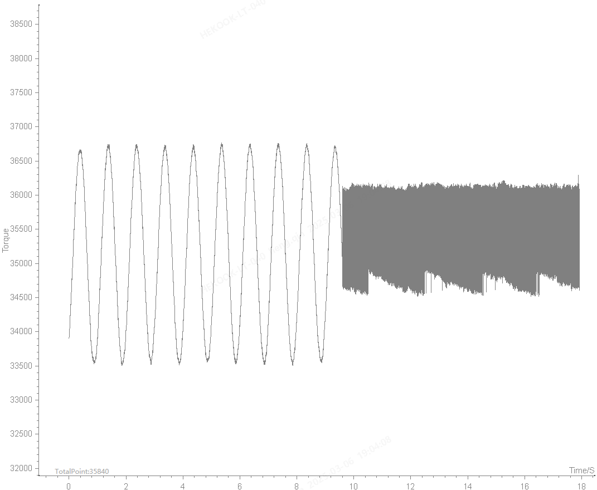
  * 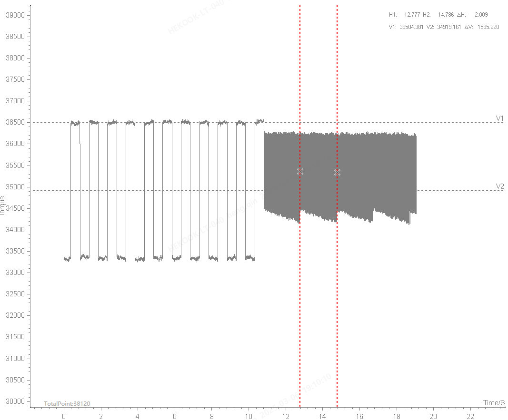

* [x] 485误码率高
  * 重写串口接收HAL_UART_Receive_DMA()为UART_Receive_DMA()
  * 进不了DMA2_Stream2_IRQHandler中断
  * 不是串口的问题，是TXRX切换完，马上串口传输的原因，应该要等待一段时间
  * 错值还是有，分析是485中断打断在了赋值时，赋值到一半打断，然后将值传出去

* [ ] 高采样率能否采峰值
  * 正弦波
    * 1Hz, 10mV, PGA=100: 100% 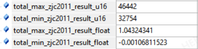
    * 1KHz, 10mV, PGA=100: 87% 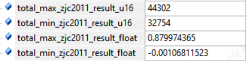
    * 5KHz, 10mV, PGA=100: 65% 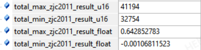
    * 10KHz, 10mV, PGA=100: 60% 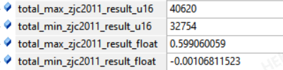
  * 方波
    * 1Hz, 10mV, PGA=100: 100%
    * 1KHz, 10mV, PGA=100: 98%
    * 5KHz, 10mV, PGA=100: 68%
    * 10KHz, 10mV, PGA=100: 62%
  * 正弦波B
    * 1Hz, 2.5mV, PGA=100: 0x8960(2400)
    * 1KHz, 2.5mV, PGA=100: 0x84DA(1214)
  * 方波B
    * 1Hz, 2.5mV, PGA=100: 0x8A50(2640)
    * 1KHz, 2.5mV, PGA=100: 0x882F(2095)
  * 正弦C
    * 0x8E92 = 36498-32768=3730
    * 0x8AA3 = 35491-32768=2723
    * 0.73
    * 36310-32768=3,542
    * 35401-32768=2,633
    * 0.74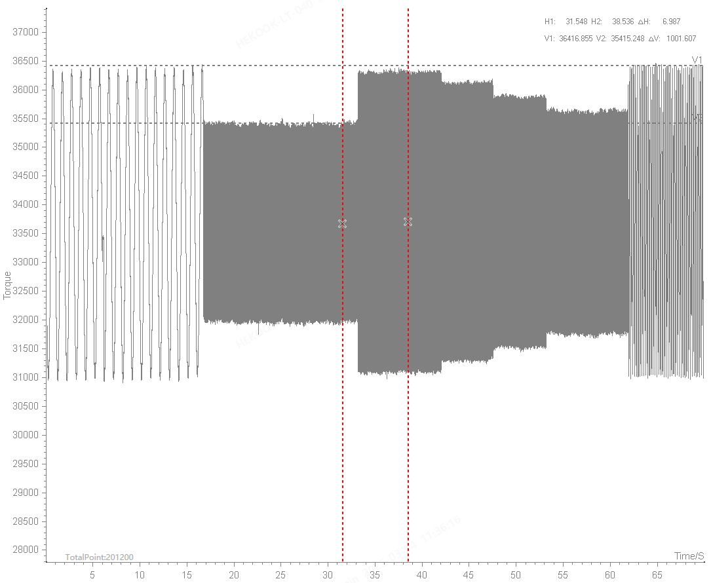
  * 原因：运放压摆率不足
  * 负载过大
  * 上位机没能显示出最大值，上位机显示最大33041，ADC采样最大33244, 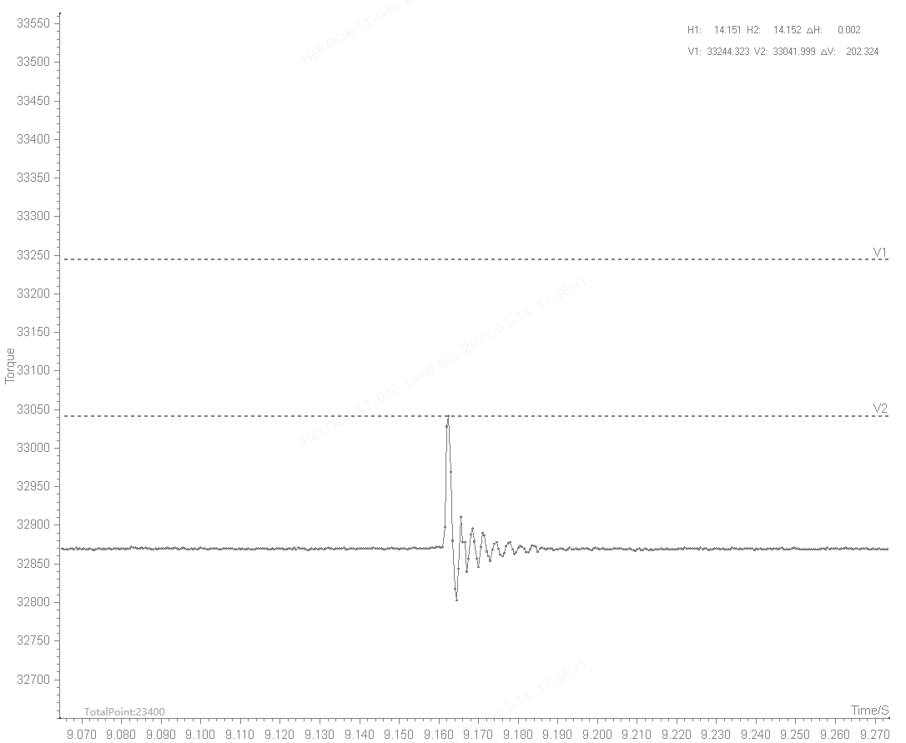

* [x] 错误值
  * 误码率为0的情况下，时不时出现一个异常值，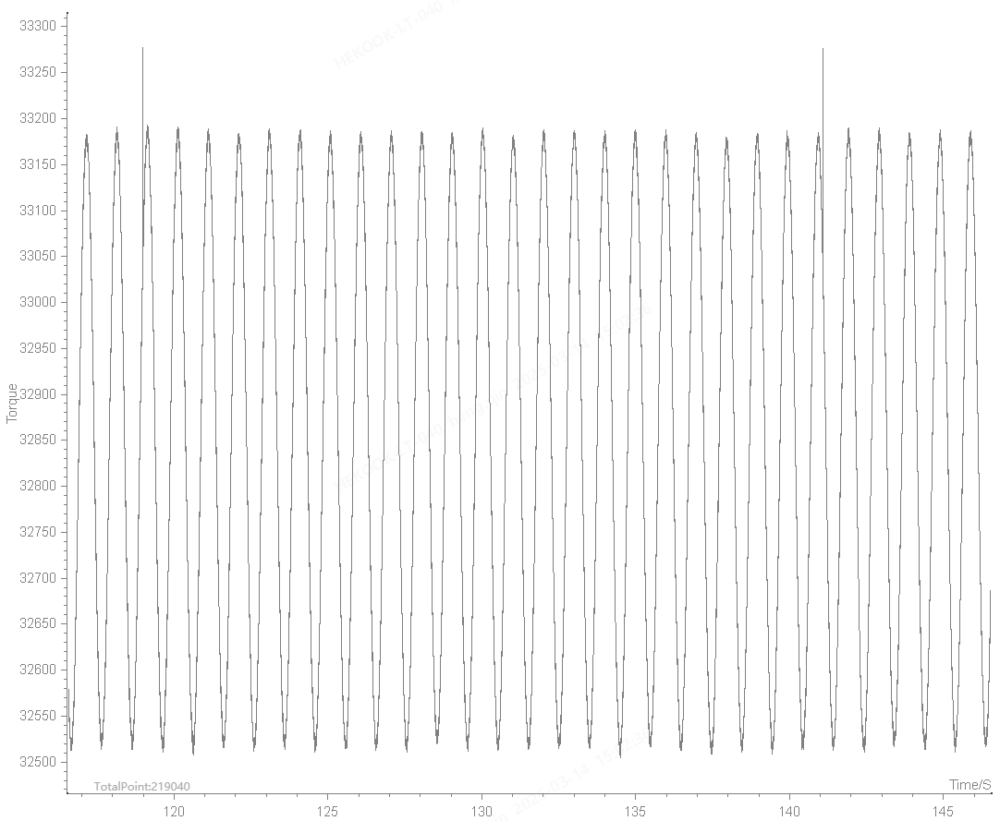
  * 换了个座，然后用压力传感器，没有出现什么异常值
  * 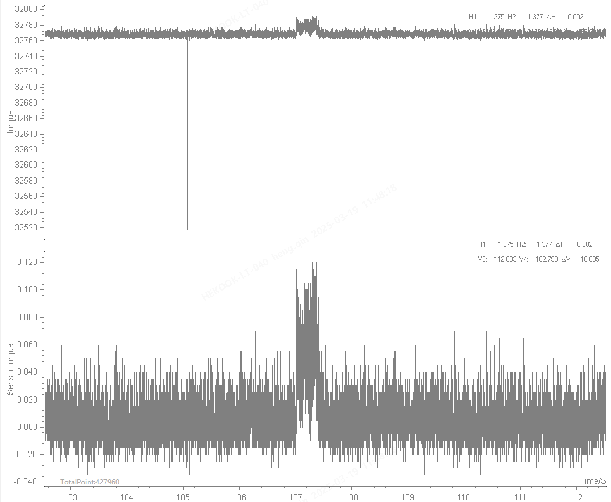
  * 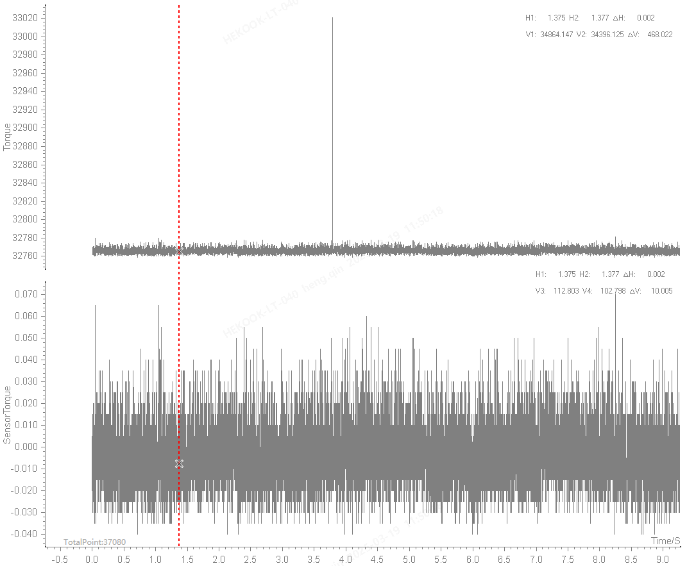
  * 压力传感器完全没问题

* [x] 抖动
  * 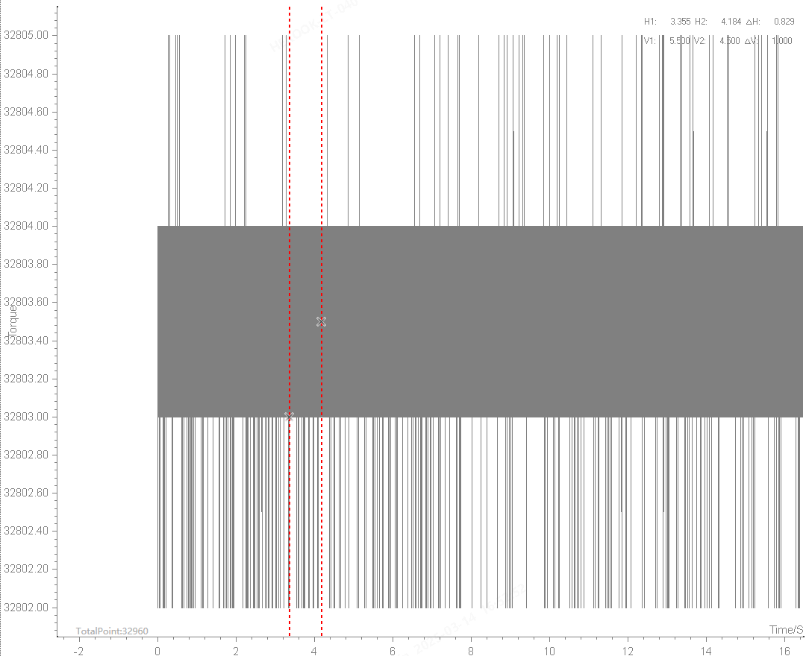
  * 更改电容，
  * 抖动5，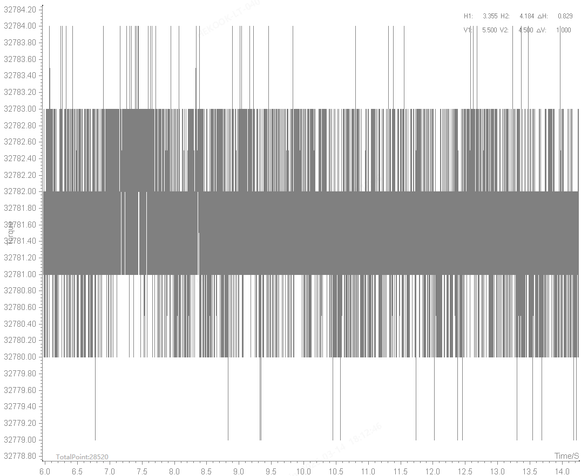
  * 短接，抖动4, 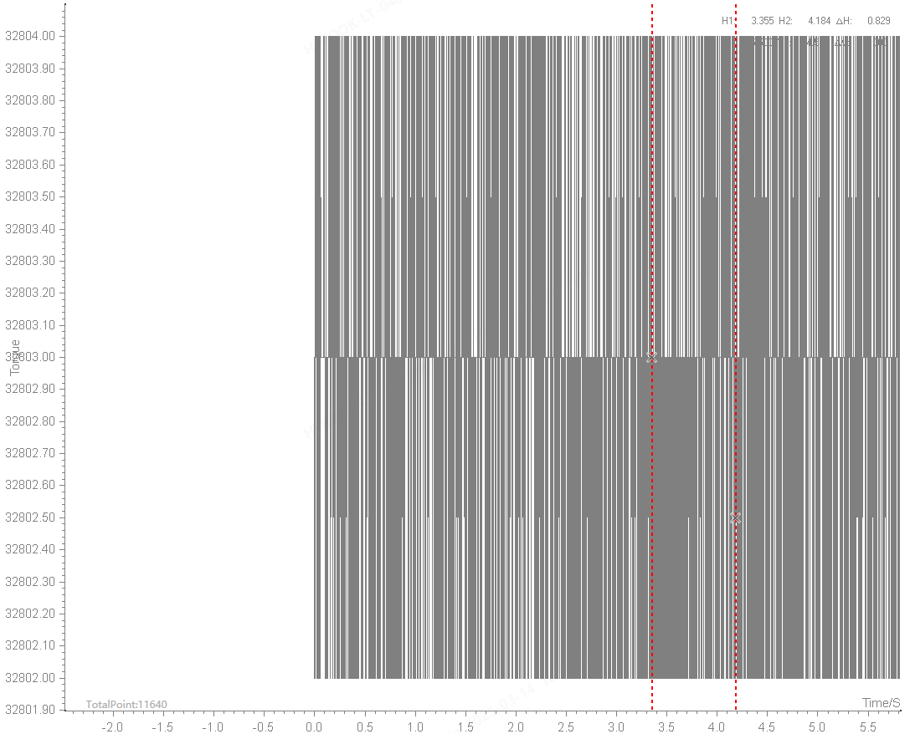
  * 抖动24

* 25/3/20实验
  * 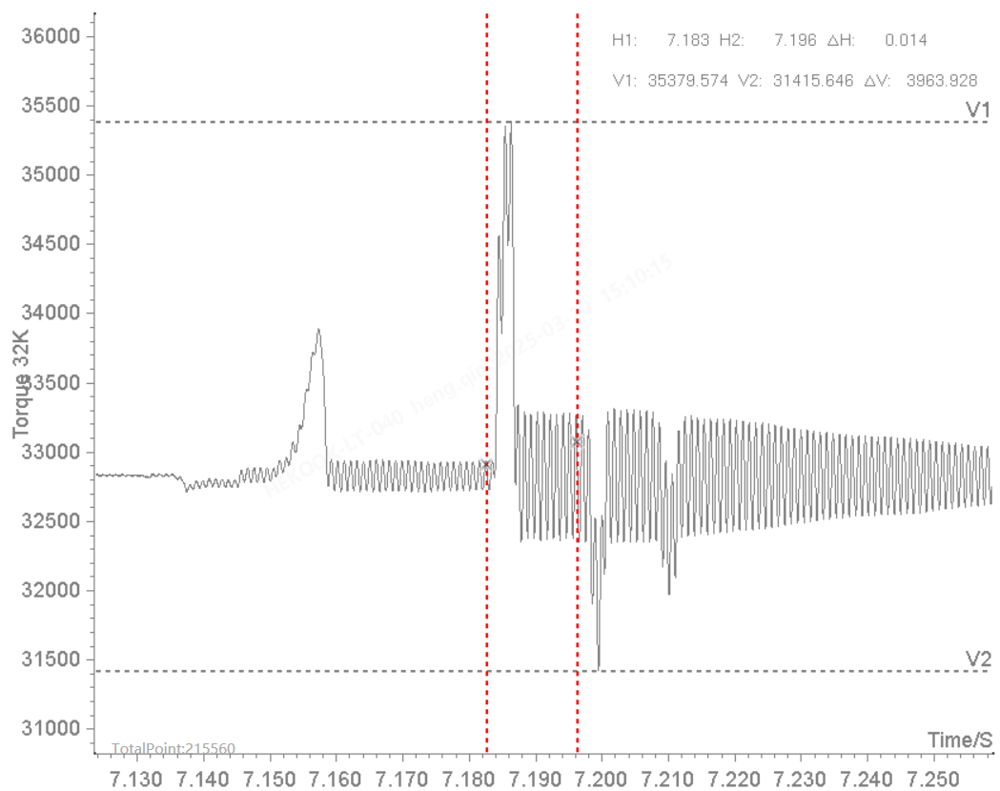
  * 35380-32768=2612
  * 2612/32768*2.5=0.199V
  * 2mV/V
  * 35957-32768=3189
  * 3189/32768*2.5=0.243V

* 32K输出
  * 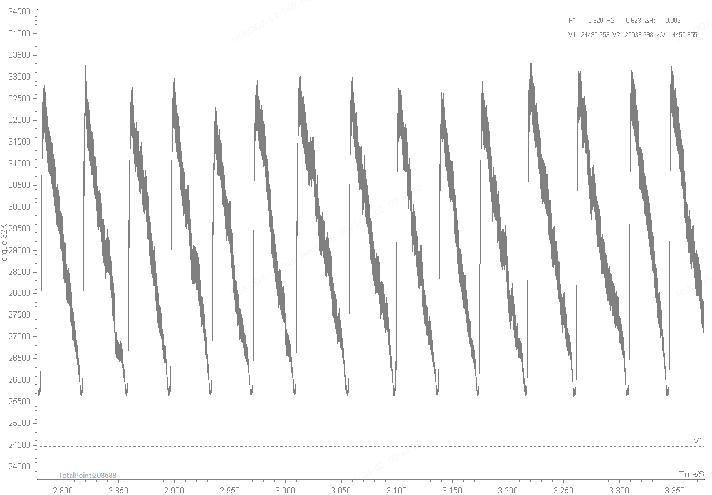

* 中断分析
  * USART1_IRQHandler, 优先级0, 0
    * 串口空闲中断: 编码器处理，CRC校验，串口发送
    * 串口发送完成中断: 串口接收
  * TIM1_UP_TIM10_IRQHandler, 优先级1, 0
    * 先后处理
    * ADC开始采样
    * 
  * TIM2_IRQHandler, 优先级0, 0
    * ADC开始通讯
  * DMA2_Stream0_IRQHandler, 优先级0, 0
    * ADC数据后处理