# 1、简介

* 在无线螺丝刀中，DCDC模块用于将输出电压提升到目标电压。
* 由于电机转速与电压大小成正比，故必须对进行有效控制。

# 2、原理

## 开关频率

* 较高的开关频率通常可以
  * 减小输出电压的纹波，因为更频繁的开关动作意味着电感和电容有更多机会平滑输出。
  * 增加开关损耗，因为每个开关动作都会有一定的开关损耗（如开关管的寄生电容和电感损耗）。
  * 增加高频电磁干扰，因为开关的高频信号可能会产生更多的辐射干扰。
  * 输出滤波器（电感和电容）可以设计得较小，因为更频繁的开关会帮助更好地滤波。
  * 使控制系统更快速地响应负载变化，但也可能带来控制复杂性增加和稳定性问题。
* 因此，开关频率的选择通常是一个折衷，需根据应用的具体要求来优化，比如对纹波、效率、电磁干扰的要求等。

## 死区时间

* 上下管不能同时开启
* 上管可以一直关，但这会增加损耗
* 当不升压时，上管可以一直打开，以减小静态损耗，因为大多数时间不是高转速

## PI控制

# 3、开发状态

## v0.2.3

* 修改了电压ADC的量程，可以实现升压。

## v0.2.4

* [x] PI系数: 暂时没问题
* [x] 电流ADC系数: 0.478A偏置
* [ ] Flash: 删去, 参数由1176配置
* [ ] 控制
  * 升压模式：上管全关, 下管PWM控制
  * 上管直通：上管全开

# 4、开发记录

## 25/1/20

* 电流
  * 修改电流参数前，实际输出电流1A，测量值0.7A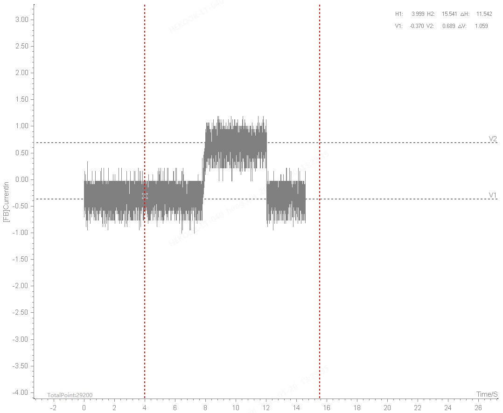
  * 不升压工作：-0.887~0.151=-0.368A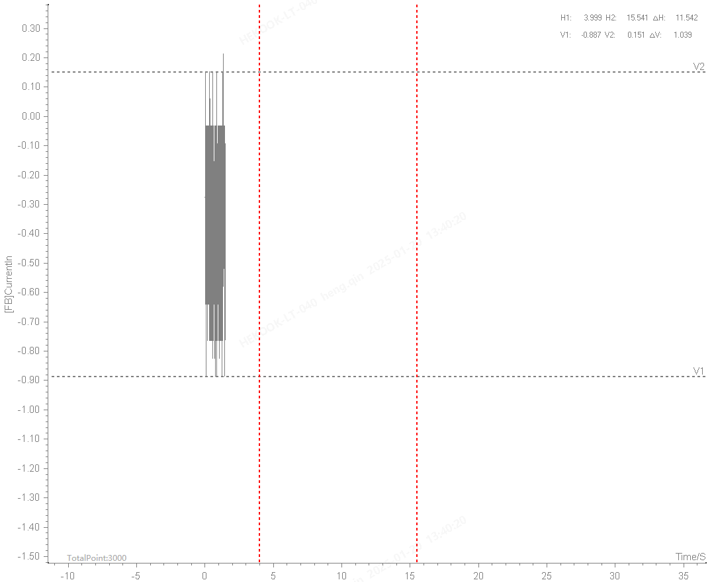
  * 输出1A：0.212~1.133=0.6725A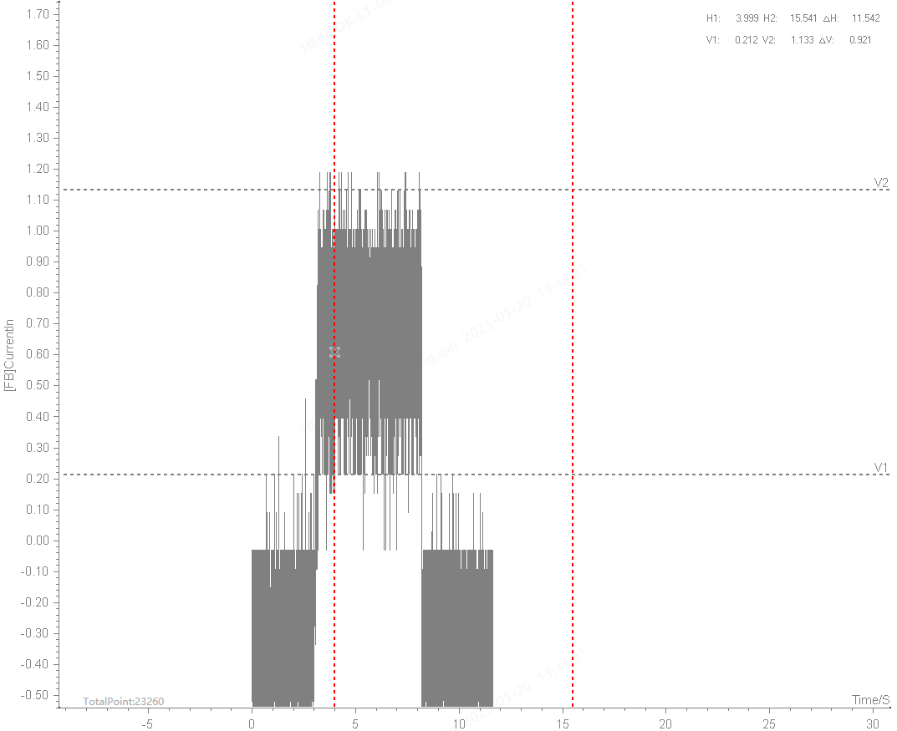
* PI系数: 这不是好得很吗，输出0到4A的输出变化，48V电压几乎没抖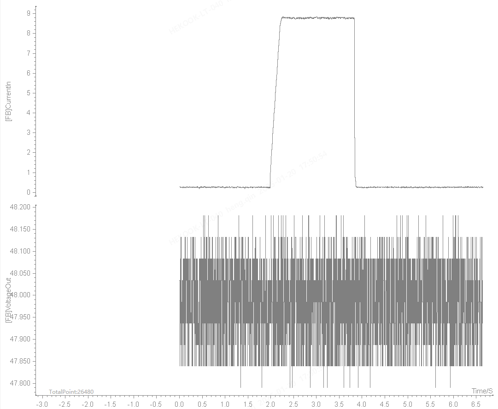
* 状态图

## 25/1/21

* 错误：1176要升压，但实际未升压
* 不升压也可能有制动
* 不用同步整流：PWM只控下管，不控上管，直接关
* 上管常关，开上管条件
  * 速度：多少速度以下
  * 扭矩：多少扭矩以上
* 运行过程中开DCDC，能不能稳定

## 25/2/14

* 测试不同压摆率下，空载升压的输入电流大小，测试到24A停止，起始电压15V, 目标电压48V
  * 压摆率: 升压最大输入电流
  * 图：输入电压，输出电压，输入电流，示波器采样的输入电流

## 25/2/19
* 温敏电阻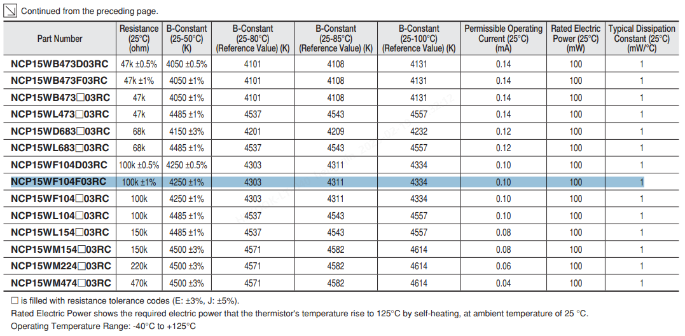
* 模式B升压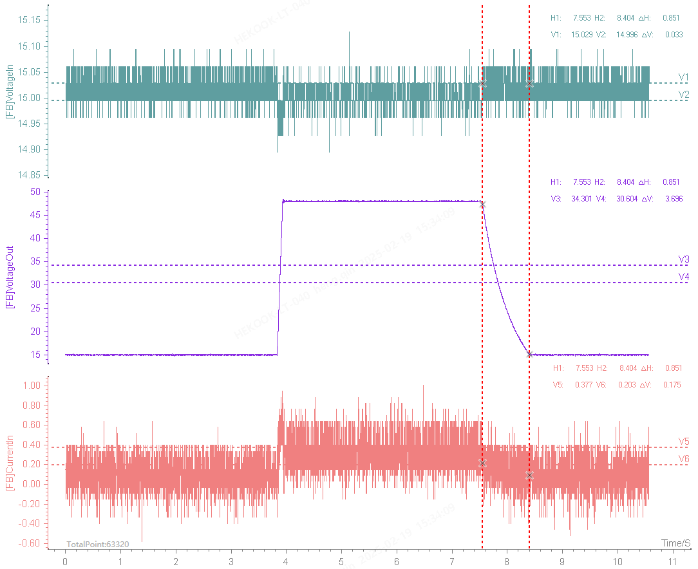
* DCDC两种模式
  * 电压调节模式(上管关，下管PWM)
  * 上管直通模式(上管开，下管关)

* 温度标定
  * 28.7: 3645
  * 34.5: 3545
  * 39.3: 3447
  * 43.9: 3327
  * 47.3: 3222
  * 57.0: 2933
  * 64.5: 2687
  * 68.7: 2545
  * 69.9: 2503
* 代码版本: v0.4.1, 压摆率设置为3000V/s，启动时间约20ms. 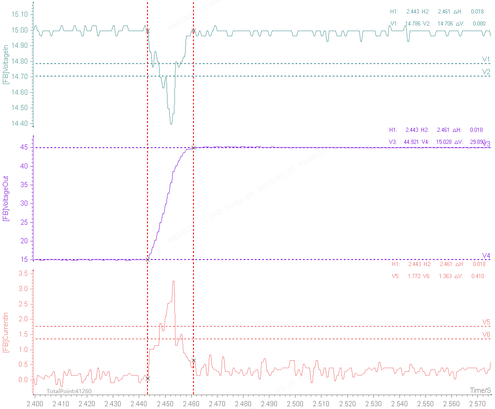

* KP=50, KI=0.037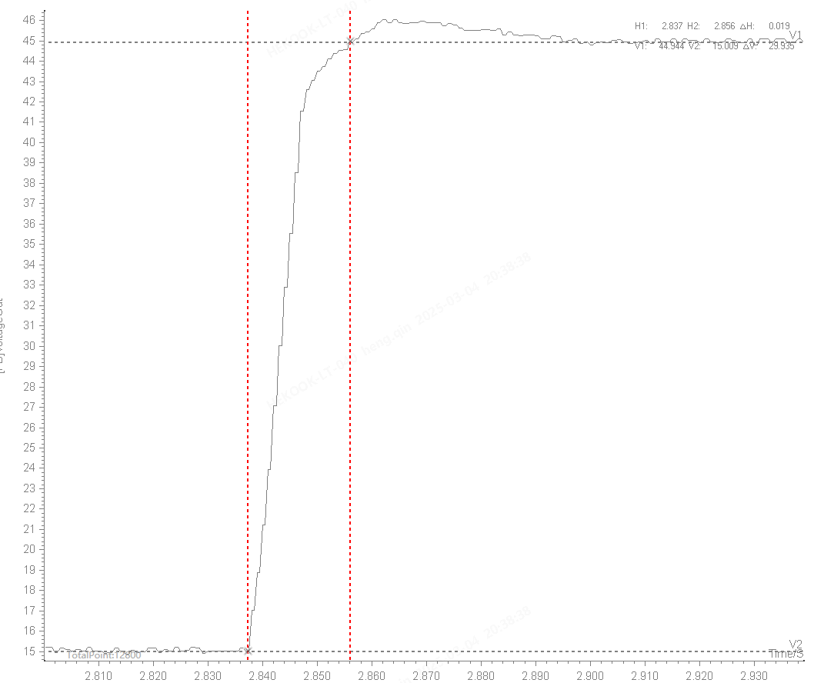
* KP=150, KI=0.2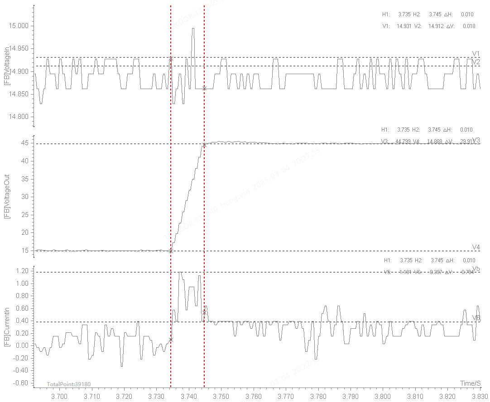
* KP=150, KI=0.15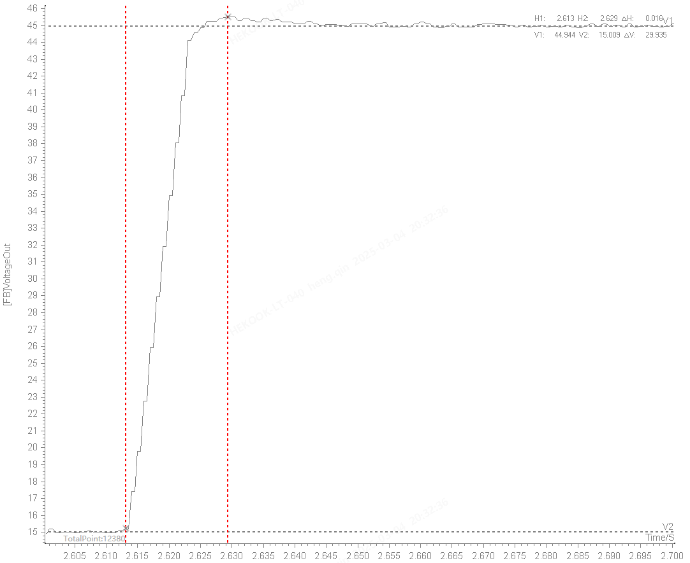
* KP=180, KI=0.1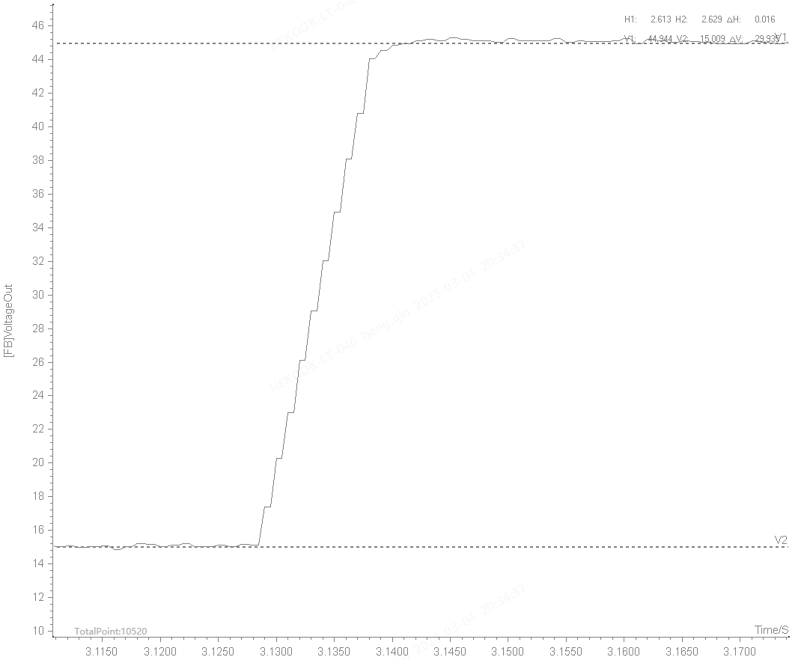